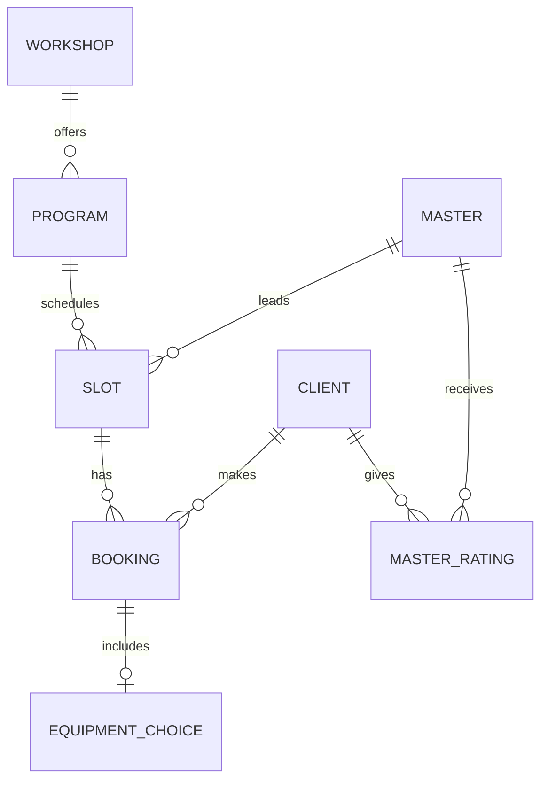
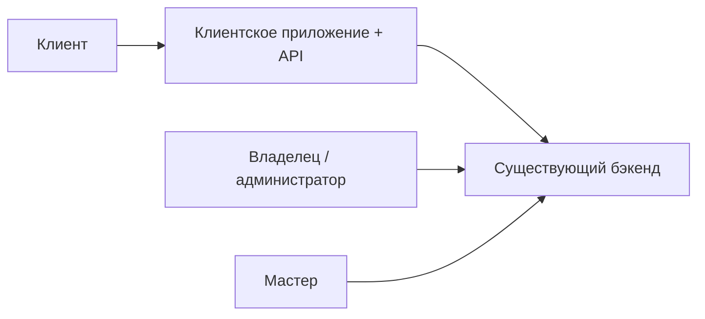

# Описание домена — гончарная мастерская «Глина»

> Этап выявления требований. Источники: [brief-pottery.md](../0-customer-brief/brief-pottery.md),
> [customer-questions.md](customer-questions.md) (ответы зафиксированы 03.07.2026).

---

## 1. Предметная область

**Гончарная мастерская** — площадка для групповых практических занятий по гончарному делу. В данном проекте речь о мастерской **«Глина»** (небольшая мастерская в центре города), где проводятся **групповые мастер-классы** длительностью **2–2,5 часа**.

Предметная область проекта — **управление записью клиентов на мастер-классы**: просмотр расписания, бронирование, выбор экипировки (своё / прокат), отмены, оценки мастеров, уведомления. Операционная работа (расписание, мастера, отмены по форс-мажору, учёт кругов) — в **существующем бэкенде и админке**. В фокусе — **клиентское мобильное приложение (Android, MVP)** и **Client API** (R-028).

---

## 2. Ключевые сущности

| Сущность | Описание |
| :-- | :-- |
| **Мастерская** | Площадка с адресом; **10 гончарных кругов** — общий ресурс |
| **Программа** | Тип занятия: простая лепка для новичков, работа на гончарном круге; определяет **цену** |
| **Слот (занятие)** | Конкретное занятие: дата и время (2–2,5 ч), программа, мастер, лимит и свободные места |
| **Мастер** | Ведёт занятие; лимит группы (в т.ч. **6** на новичковые) **настраивается на уровне мастера** |
| **Клиент** | Записывается на слот; своё или прокатное снаряжение; может быть **постоянным** |
| **Бронь (запись)** | Связь «клиент ↔ слот»; статусы (активна, отменена клиентом, отменена мастерской, посещена и др.) |
| **Экипировка** | Инструменты, фартук — своё или прокат (на цену не влияет) |
| **Оценка мастера** | Звёзды 1–5; одна оценка на пару «клиент ↔ мастер», публичный рейтинг |

---

## 3. Бизнес-правила

### Вместимость и расписание

- На мастерской **10 гончарных кругов**; на **новичковые группы** — не более **6 человек**; лимит настраивается **в зависимости от мастера**, ведущего занятие.
- На занятиях **на гончарном круге** лимит привязан к **свободным кругам** — **до 10**.
- Расписание на **неделю вперёд**; в приложении по умолчанию — **7 дней** (R-027); расширение — фильтр дат.
- Фильтры MVP: **время суток**, **уровень**, **программа** (лепка / круг) (фильтр по мастеру — не в первой версии).
- Доступность для клиента: **«есть места» / «мест нет»** (номер круга в UI не показываем).
- **Не более 1 записи в день** на клиента; **один человек на одну запись**.
- **Двойная запись** (в т.ч. двое на один круг) исключается **бэкендом** — атомарная проверка свободных мест (R-004).
- Группа заполнена → только **«мест нет»** (лист ожидания **не** в MVP).
- Проверка уровня клиента **не требуется**.

### Бронирование и экипировка

- Идентификация: **имя + телефон** при первой записи.
- Клиент выбирает **своё** или **прокат** (инструменты, фартук).
- **Прокат не влияет на цену** (исключение: повреждение / поломка прокатного оборудования).
- Если прокатный фонд исчерпан — запись **возможна только «со своим»** снаряжением.
- Цена зависит от **программы**; показывается в приложении; оплата **на месте** (наличные / перевод).
- Сезонные помощники отображаются как **другой мастер** в карточке (без отдельной пометки).

### Отмена клиентом

- **Ранняя отмена:** ≥ **3 часов** до начала → место **сразу** освобождается.
- **Поздняя отмена:** < 3 часов → **предупреждение** (заготовленная глина простаивает); отмена **разрешена**, штрафов в MVP **нет**.
- **Учёт** поздних отмен ведётся; последствий для клиента пока **нет**.

### Отмена мастерской (форс-мажор, R-008)

- Бронь → статус **«Отменено мастерской»** + **причина** (фиксированный список + свободный текст из админки).
- Типовые причины: **поломка печи**, **отключение электричества**, болезнь мастера.
- **Push** с просьбой **перезаписаться на другое занятие**; перезапись из push и экрана детали.
- Повторная запись на **отменённый слот запрещена**.
- Уведомление о **переносе** занятия (смена времени / мастера) — **нужно**.

### Оценки мастеров

- Только после **посещённого** занятия; срок — **в течение недели**.
- Формат: **звёзды** (без текстовых отзывов в MVP).
- Рейтинги **видны** другим клиентам при выборе слота.
- **Один пользователь — одна оценка на мастера**; можно изменить в течение недели или при повторном занятии с тем же мастером.

### Постоянные клиенты

- **Метка** в профиле + **приоритет записи** (скидки — не в MVP).

### Уведомления (MVP)

Push в приложении: напоминание **за день** и **за 2 часа**, подтверждение записи, отмена (клиент / мастерская), перенос занятия.

---

## 4. Акторы

| Актор | Роль | В скоупе MVP |
| :-- | :-- | :-- |
| **Клиент** | Запись, отмена, оценки, уведомления | **Да** (R-028) |
| **Мастер** | Ведение занятия в мастерской | **Нет** — существующий интерфейс |
| **Владелец (Марина)** | Расписание, правки, админка | **Нет** — существующая админка |

---

## 5. Основные процессы

### 5.1. Просмотр расписания

Клиент видит занятия на 7 дней с фильтрами (время, уровень, программа). Карточка: время, программа (кратко), мастер, рейтинг, «есть места / мест нет», цена. Empty state: **«Пока нет доступных занятий»**.

### 5.2. Бронирование

Выбор слота → контакты (имя, телефон) → экипировка (своё / прокат) → подтверждение. Бэкенд атомарно проверяет места и прокат.

### 5.3. Отмена брони

Клиентом (с правилами 3 ч) или мастерской (форс-мажор) — см. §3.

### 5.4. Оценка мастера

После посещённого занятия — звёзды в течение недели; публичный рейтинг на карточке слота.

### 5.5. Форс-мажор

Поломка печи / отключение электричества → отмена в админке → push + перезапись (R-008).

---

## 6. Границы системы

### В скоупе MVP

- **Android**-приложение для роли «Клиент»
- **Client API** (слоты, брони, профиль, мастера/рейтинги, прокат — R-015)
- Офлайн-просмотр **своих записей**
- Корректная обработка отказа бронирования при отсутствии мест (R-004)

### Вне скоупа / backlog

- iOS (вторая платформа)
- Админка, интерфейс мастера, экран владельца
- Онлайн-оплата
- Лист ожидания
- Фильтр по мастеру
- Текстовые отзывы
- SMS / email / Instagram
- Скидки для постоянных (метка и приоритет — **в MVP**)
- Внутренняя реализация бэкенда (R-004), миграция данных (R-015)

---

## 7. Болевые точки

Запись через **Instagram-директ и ежедневник** → в выходные путаница, **двойные брони на один круг**, клиент приходит — группа уже началась или мест нет. Цель — **самообслуживание записи** для клиентов; владелец только **наблюдает** расписание.

---

## 8. Глоссарий

| Термин | Определение |
| :-- | :-- |
| **Мастер-класс** | Групповое занятие 2–2,5 ч под руководством мастера |
| **Программа** | Тип занятия: лепка для новичков или работа на гончарном круге; определяет цену |
| **Слот** | Конкретное занятие в дату и время |
| **Гончарный круг** | Рабочее место у круга; всего 10 на мастерской |
| **Прокат** | Инструменты и/или фартук на время занятия |
| **Постоянный клиент** | Метка + приоритет записи |
| **Ранняя отмена** | ≥ 3 ч до начала |
| **Поздняя отмена** | < 3 ч до начала; предупреждение о заготовленной глине |
| **Empty state** | «Пока нет доступных занятий» |

---

## 9. Трассировка Q&A → домен

| Тема | Ответ заказчика | § домена |
| :-- | :-- | :-- |
| Имя + телефон | Да | §3 |
| 1 запись / день, 1 человек | Да | §3 |
| Без листа ожидания | Да | §3, §6 |
| Лимит 6 / до 10 кругов | По мастеру; на круге — до 10 | §3 |
| «Есть места / мест нет» | Да | §3 |
| Прокат → только «со своим» при исчерпании | Да | §3 |
| Отмена ≥ 3 ч | Да | §3 |
| Оценка — неделя, 1 на мастера | Да | §3 |
| Push-only, все типы MVP | Да | §3 |
| Android, русский, офлайн записей | Да | §6 |
