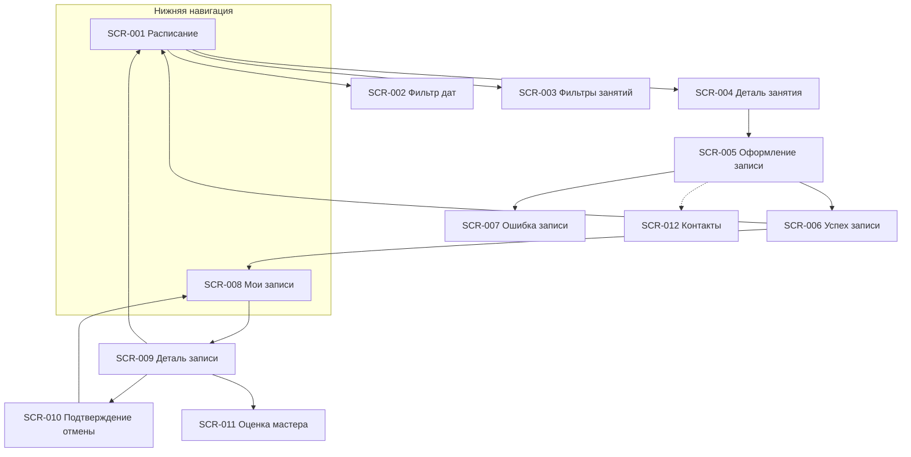

# Реестр экранов — гончарная мастерская «Глина»

> Клиентское мобильное приложение Android (роль «Клиент», R-028).
> Источники: [2-requirements/](../2-requirements/), [1-elicitation/](../1-elicitation/).
> Постановки на дизайн: [screens/](screens/).

## Навигация приложения

---

## Реестр

| ID | Экран | Тип | Приоритет | Use Case / FR | Постановка |
| :- | :-- | :-- | :--: | :-- | :-- |
| SCR-001 | Расписание занятий | Экран (вкладка) | Must | UC-001; FR-001–FR-005, FR-011, FR-023 | [SCR-001-schedule.md](screens/SCR-001-schedule.md) |
| SCR-002 | Фильтр периода дат | Bottom sheet | Must | FR-002; R-027 | [SCR-002-date-filter.md](screens/SCR-002-date-filter.md) |
| SCR-003 | Фильтры занятий | Bottom sheet | Must | FR-003 | [SCR-003-session-filters.md](screens/SCR-003-session-filters.md) |
| SCR-004 | Деталь занятия | Экран | Must | UC-001, UC-002; FR-004, FR-008, FR-011, FR-012, FR-023 | [SCR-004-session-detail.md](screens/SCR-004-session-detail.md) |
| SCR-005 | Оформление записи | Экран | Must | UC-002; FR-006–FR-012, FR-019, FR-025 | [SCR-005-booking-form.md](screens/SCR-005-booking-form.md) |
| SCR-006 | Успешная запись | Экран / modal | Must | UC-002; FR-009, FR-010, FR-012, FR-024 | [SCR-006-booking-success.md](screens/SCR-006-booking-success.md) |
| SCR-007 | Ошибка записи | Dialog / modal | Must | UC-002; FR-008–FR-011, FR-019 | [SCR-007-booking-error.md](screens/SCR-007-booking-error.md) |
| SCR-008 | Мои записи | Экран (вкладка) | Must | UC-003; FR-013; NFR-009 | [SCR-008-my-bookings.md](screens/SCR-008-my-bookings.md) |
| SCR-009 | Деталь записи | Экран | Must | UC-003–UC-007; FR-013–FR-024 | [SCR-009-booking-detail.md](screens/SCR-009-booking-detail.md) |
| SCR-010 | Подтверждение отмены | Bottom sheet / Dialog | Must | UC-004; FR-014, FR-015 | [SCR-010-cancel-confirm.md](screens/SCR-010-cancel-confirm.md) |
| SCR-011 | Оценка мастера | Bottom sheet / modal | Must | UC-007; FR-021–FR-023 | [SCR-011-rate-master.md](screens/SCR-011-rate-master.md) |
| SCR-012 | Контактные данные | Секция / Bottom sheet | Must | FR-006; FR-025 | [SCR-012-contact-profile.md](screens/SCR-012-contact-profile.md) |

---

## Сквозные NFR для всех экранов

| ID | Требование | Источник |
| :- | :-- | :-- |
| NFR-001 | Android-клиентский интерфейс | [NFR-001](../2-requirements/non-functional-requirements.md) |
| NFR-008 | Только русский язык | [NFR-008](../2-requirements/non-functional-requirements.md) |
| NFR-010 | Push-уведомления (deep link на SCR-009 / SCR-001) | FR-017, FR-020, FR-024 |
| NFR-009 | Офлайн: кэш «Мои записи» (SCR-008, SCR-009) | [NFR-009](../2-requirements/non-functional-requirements.md) |

---

## Статусы брони (отображение на SCR-008, SCR-009)

| Статус | Отображение | Действия клиента |
| :-- | :-- | :-- |
| Активна | Бейдж «Записан» | Отменить (SCR-010) |
| Активна + перенос | Бейдж «Записан» + info-блок переноса | Отменить (SCR-010); info только для чтения |
| Отменена клиентом | Бейдж «Отменена вами» | — |
| Отменена мастерской | Бейдж «Отменено мастерской» + причина | Перезаписаться на другое занятие (SCR-001) |
| Посещена | Бейдж «Посещена» | Оценить мастера (SCR-011) |

> На SCR-009 блоки **«Отменено мастерской»** и **«Перенос»** — взаимоисключающие (см. [SCR-009-booking-detail.md](screens/SCR-009-booking-detail.md)).

---

## Фильтры SCR-003 (MVP)

| Фильтр | Значения | Примечание |
| :-- | :-- | :-- |
| Время суток | Утро / День / Вечер | FR-003 |
| Уровень | Начинающий / Средний / Продвинутый | FR-003 |
| Программа | Лепка / Работа на круге | FR-003; **multi-select, OR** внутри группы |
| ~~Мастер~~ | — | **Не в MVP** |

---

## Отличия от кулинарной студии (task2)

| Аспект | «Глина» |
| :-- | :-- |
| Аллергии | **Нет** |
| Лист ожидания | **Нет** |
| Доступность мест | **«Есть места» / «Мест нет»** (без номера круга и счётчика) |
| Прокат исчерпан | Запись **«со своим»** (не блокировка слота) |
| Фильтры | Время, уровень, **программа** (без мастера) |
| Длительность | **2–2,5 ч** |
| Поздняя отмена | Предупреждение о **заготовленной глине** |
| Статус форс-мажора | **«Отменено мастерской»** |
