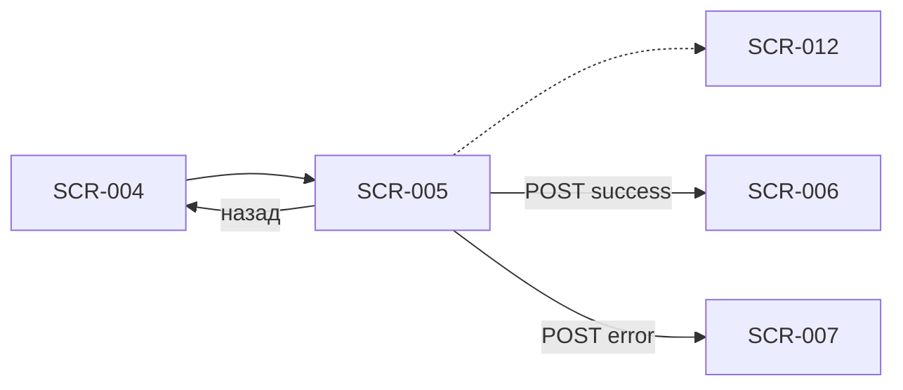

# Оформление записи

**ID:** SCR-005  
**Тип:** Экран  
**Домен:** 02. Бронирование  
**Приоритет:** Critical  
**Статус:** Актуален  
**Сессия клиента:** Не требуется (первая запись); ClientSession — Bearer при повторной записи  
**Дизайн-макет:** Figma — TBD · **Design brief:** [SCR-005-booking-form.md](SCR-005-booking-form.md)

> **Платформа:** Android (NFR-001) · **Язык UI:** только русский (NFR-008) · **Оплата:** на месте (FR-012).

---

## Содержание

- [Обзор](#обзор)
- [Навигация](#навигация)
- [Входные данные](#входные-данные)
- [Применяемые логики](#применяемые-логики)
- [Инициализация](#инициализация)
- [Используемые запросы](#используемые-запросы)
- [Макет экрана](#макет-экрана)
- [Элементы экрана](#элементы-экрана)
- [Состояния экрана](#состояния-экрана)
- [Связанные требования](#связанные-требования)
- [Критерии приёмки](#критерии-приёмки)

---

## Обзор

Экран сбора данных для бронирования занятия в гончарной мастерской «Глина»: контактные данные ([SCR-012](#секция-контактов-scr-012)), выбор экипировки (своё / прокат инструментов и фартука) и итоговая стоимость перед отправкой `createBooking`. Цена зависит **только от программы**; прокат на неё не влияет (FR-012). Закрывает FR-006, FR-007, FR-008, FR-009, FR-010, FR-012, FR-025.

### User Story

> Как клиент, я хочу оформить запись на занятие, указав контакты и экипировку, чтобы мастерская подготовилась к моему визиту, а я увидел итоговую сумму к оплате на месте.

**Не в MVP:** лист ожидания при `NO_SPOTS` (FR-011) — только возврат к расписанию; фильтр по мастеру; iOS; шаг аллергий.

---

## Навигация

### Входящая

| Источник | Триггер | Условие | Параметры |
| :-- | :-- | :-- | :-- |
| SCR-004 | CTA «Записаться» | `freeSpots > 0`, `status = OPEN` | `slotId` |
| SCR-009 → SCR-001 → SCR-004 | Перезапись после отмены мастерской | Профиль может быть заполнен | `slotId` |
| Push / deep link | Косвенный вход | Только через выбор слота (SCR-001 → SCR-004) | `slotId` |

### Исходящая

| Назначение | Триггер | Параметры |
| :-- | :-- | :-- |
| SCR-004 | «Назад» / системная кнопка «Назад» | — |
| SCR-006 | `createBooking` → 201 | `bookingId`, `sessionToken` |
| SCR-007 | `createBooking` → 403/409 или 5xx после retry | код ошибки |
| SCR-012 (sheet) | «Изменить» в сводке контактов | `profile` |

> **Нижняя навигация:** 2 вкладки — «Расписание» (SCR-001) | «Мои записи» (SCR-008). Отдельной вкладки «Профиль» нет.



---

## Входные данные

| Название | Тип | Источник | Описание |
| :-- | :-- | :-- | :-- |
| `slotId` | uuid | Навигация | Идентификатор выбранного занятия |
| `slot` | SlotDetail | API `getSlot` | Детали занятия для сводки и проверки проката |
| `profile` | ClientProfile | API `getProfile` | Контакты клиента; 404 → режим первой записи |
| `profile.isComplete` | boolean | API `getProfile` | Inline-поля vs сводка контактов |
| `profile.isRegularClient` | boolean | API `getProfile` | Бейдж «Постоянный клиент» (FR-025) |
| `slot.rentalAvailability` | RentalAvailability | API `getSlot` | Доступность инструментов и фартука |
| `slot.price` | decimal? | API `getSlot` | Цена программы для блока «Итого» |
| `equipment` | EquipmentChoice | Локально | `mode`: OWN \| RENTAL; чекбоксы проката |

---

## Применяемые логики

| Логика | Элемент / триггер | Описание |
| :-- | :-- | :-- |
| [LOGIC-001_Контактный-профиль](../../5-mobile-app-spec/09_Логики/LOGIC-001_Контактный-профиль.md) | Секция SCR-012, валидация, submit | Режимы inline / сводка; бейдж постоянного клиента; upsert при `createBooking` |
| [LOGIC-003_Цена-занятия](../../5-mobile-app-spec/09_Логики/LOGIC-003_Цена-занятия.md) | Блок «Итого», CTA | Цена только от программы; прокат бесплатный; оплата на месте |
| [LOGIC-008_Паттерн-состояний-экрана](../../5-mobile-app-spec/09_Логики/LOGIC-008_Паттерн-состояний-экрана.md) | Загрузка, submit | Loading / Content / Error + Submitting на CTA |

---

## Инициализация

### Запросы при открытии

| № | operationId | Критичный | Условие |
| :-: | :-- | :--: | :-- |
| 1 | `getSlot` | Да | При открытии по `slotId` |
| 2 | `getProfile` | Нет | Параллельно; 404 → первая запись, inline-режим SCR-012 |

---

## Используемые запросы

### getSlot

**Метод:** GET  
**Путь:** `/slots/{slotId}`  
**Спецификация:** [../../api/openapi.yaml](../../api/openapi.yaml) → `getSlot`

**Обработка ответа:**

| HTTP / код | UI-реакция |
| :-- | :-- |
| 200 + data | Content: сводка занятия, блок цены, настройка экипировки по `rentalAvailability` |
| 200 + data (`rentalFullyExhausted = true`) | Radio «Прокат» disabled; только «Со своим» + пояснение (FR-008) |
| 404 | Error state + «К расписанию» |
| 5xx / timeout | Error state + «Повторить» |

---

### getProfile

**Метод:** GET  
**Путь:** `/profile`  
**Спецификация:** [../../api/openapi.yaml](../../api/openapi.yaml) → `getProfile`

**Обработка ответа:**

| HTTP / код | UI-реакция |
| :-- | :-- |
| 200 + data (`isComplete = true`) | Сводка SCR-012; CTA активен при валидной экипировке |
| 200 + data (`isComplete = false`) | Inline-поля SCR-012 |
| 404 | Первая запись: пустые контакты |
| 401 | Повтор без сессии → режим первой записи (inline) |
| 5xx / timeout | Snack; форма в режиме inline с ручным вводом |

---

### updateProfile

**Метод:** PATCH  
**Путь:** `/profile`  
**Спецификация:** [../../api/openapi.yaml](../../api/openapi.yaml) → `updateProfile`

**Обработка ответа:**

| HTTP / код | UI-реакция |
| :-- | :-- |
| 200 + data | Закрытие sheet SCR-012; обновление сводки; сохранение `sessionToken` |
| 400 `VALIDATION_ERROR` | Inline-ошибки в sheet |
| 5xx / timeout | Snack + «Повторить» в sheet |

> Опционально при «Сохранить» в sheet SCR-012. При submit формы upsert выполняется неявно в `createBooking`.

---

### createBooking

**Метод:** POST  
**Путь:** `/bookings`  
**Спецификация:** [../../api/openapi.yaml](../../api/openapi.yaml) → `createBooking`

**Тело запроса (ключевые поля):**

| Поле | Источник UI |
| :-- | :-- |
| `slotId` | Навигация |
| `client.name`, `client.phone` | SCR-012 |
| `equipment.mode`, `rentalTools`, `rentalApron` | Секция экипировки |

**Обработка ответа:**

| HTTP / код | UI-реакция |
| :-- | :-- |
| 201 + data | Сохранить `sessionToken`; переход SCR-006 с `booking.totalPrice` |
| 400 `VALIDATION_ERROR` | Inline-ошибки на SCR-005 / SCR-012 |
| 403 `SLOT_REBOOK_FORBIDDEN` | SCR-007 (modal) |
| 409 `NO_SPOTS` | SCR-007 (modal, без waitlist CTA) |
| 409 `ALREADY_BOOKED_TODAY` | SCR-007 (modal) |
| 409 `SLOT_CANCELLED` | SCR-007 (modal) |
| 409 `RENTAL_UNAVAILABLE` | SCR-007 (modal) + рекомендация «со своим» |
| 5xx / timeout | Snack + retry submit; форма сохранена |

**Доменные коды createBooking:** `NO_SPOTS`, `ALREADY_BOOKED_TODAY`, `SLOT_CANCELLED`, `RENTAL_UNAVAILABLE`, `SLOT_REBOOK_FORBIDDEN`.

> При `RENTAL_UNAVAILABLE` после «Понятно» в SCR-007 клиент остаётся на SCR-005 и переключает экипировку на «Со своим» (FR-008). Форма под modal **остаётся заполненной**.

---

## Макет экрана

```
┌─────────────────────────────────┐
│ ← Оформление записи             │
├─────────────────────────────────┤
│ Краткая сводка занятия          │
│ 📅 Ср, 9 июля · 18:00           │
│ 🏺 Лепка для новичков · ~2,5 ч  │
│ 👤 Мастер: Анна · ★ 4,8         │
├─────────────────────────────────┤
│ Контактные данные          SCR-012│
│ [🏷 Постоянный клиент]          │  ← если isRegularClient
│ Имя *     [________________]    │  ← или сводка + «Изменить»
│ Телефон * [+7 (___) ___-__-__]  │
├─────────────────────────────────┤
│ Экипировка                      │
│ ○ Со своим (инструменты и       │
│   фартук)                       │
│ ○ Нужен прокат                  │
│   ☐ Инструменты                 │
│   ☐ Фартук                      │
│ ℹ Прокат бесплатный             │
├─────────────────────────────────┤
│ Итого                           │
│ Занятие             2 800 ₽     │
│ ─────────────────────────       │
│ К оплате на месте   2 800 ₽     │
│ ℹ Оплата в мастерской «Глина»   │
├─────────────────────────────────┤
│ [ Записаться · 2 800 ₽ ] sticky │
└─────────────────────────────────┘

--- Прокат исчерпан ---

┌─────────────────────────────────┐
│ ○ Со своим (выбрано)            │
│ ○ Нужен прокат  (disabled)      │
│ ℹ Прокат закончился — можно     │
│   записаться со своим           │
└─────────────────────────────────┘

--- Submitting ---

┌─────────────────────────────────┐
│ [ ◌ Записаться ]  dim overlay   │
└─────────────────────────────────┘
```

---

## Элементы экрана

| Элемент | Описание | Источник данных | Валидация / поведение |
| :-- | :-- | :-- | :-- |
| Кнопка «Назад» | Возврат на SCR-004 | Навигация | Черновик формы не сохраняется; профиль на сервере — сохранён |
| Сводка занятия | Компактный блок: дата, программа, мастер, рейтинг | `slot.*` | Формат даты «Ср, 9 июля · 18:00»; длительность `~2–2,5 ч` |
| CTA «Записаться · XXX ₽» | Primary, sticky | `slot.price`, [LOGIC-003](../../5-mobile-app-spec/09_Логики/LOGIC-003_Цена-занятия.md) | Disabled до валидных контактов и экипировки |
| Radio «Со своим» | Инструменты и фартук клиента | Локально | По умолчанию при `rentalFullyExhausted`; чекбоксы скрыты |
| Radio «Нужен прокат» | Раскрывает чекбоксы | `slot.rentalAvailability` | Disabled при полном исчерпании проката |
| Чекбокс «Инструменты» | Прокат инструментов | Локально + API | Disabled с подписью «Нет в прокате» при недоступности |
| Чекбокс «Фартук» | Прокат фартука | Локально + API | Аналогично инструментам |
| Подпись «Прокат бесплатный» | Инфо FR-012 | — | Не добавлять строку проката в разбивку цены |
| Разбивка цены | Стоимость занятия | `slot.price` | Одна строка «Занятие»; без строк проката |
| Итого «К оплате на месте» | Сумма к оплате | `slot.price` | Равна цене программы при любом `equipment.mode` |
| Подпись «Оплата в мастерской» | Информационный блок | — | Нет интеграции с платёжными системами |
| Индикатор загрузки | Spinner на CTA | Локально | При Submitting; блокировка повторного тапа |
| Inline-ошибки | Под полями контактов / экипировки | Локальная валидация | Фокус на первое невалидное поле |

**Терминология:** **мастер**, **занятие**, **программа**; прокат (инструменты, фартук) **не влияет на цену** (FR-012).

### Секция контактов (SCR-012)

Inline-секция на SCR-005; bottom sheet при тапе «Изменить» на повторной записи. Детали — [SCR-012-contact-profile.md](SCR-012-contact-profile.md), логика — [LOGIC-001](../../5-mobile-app-spec/09_Логики/LOGIC-001_Контактный-профиль.md).

| Элемент | Описание | Источник данных | Валидация / поведение |
| :-- | :-- | :-- | :-- |
| Заголовок секции | «Контактные данные» | — | — |
| Бейдж «Постоянный клиент» | Chip при `isRegularClient` | `profile.isRegularClient` | Read-only; приоритет на бэкенде (FR-025) |
| Поле «Имя» | Inline при первой записи | `profile.name` | 1–50 символов; «Укажите имя» |
| Поле «Телефон» | Маска +7 (XXX) XXX-XX-XX | `profile.phone` | Паттерн `^\+7\d{10}$`; «Введите корректный номер» |
| Сводка (повтор) | «{name} · +7 XXX ***-XX-XX» | `profile` | Тап «Изменить» → bottom sheet SCR-012 |
| Кнопка «Сохранить» (sheet) | PATCH профиля | `updateProfile` | Активна при изменениях и валидности |

---

## Состояния экрана

| Состояние | Условие | Отображение |
| :-- | :-- | :-- |
| Loading | `getSlot` / `getProfile` в процессе | Skeleton сводки и секций |
| Content | 200 `getSlot` | Полный контент формы |
| Error | 404 / 5xx `getSlot` | Баннер + «Повторить» / «К расписанию» |
| Offline | Нет сети при открытии | «Нет подключения к интернету» + retry (без кэша в MVP) |
| Первая запись | 404 / пустой профиль | Inline SCR-012; CTA disabled до валидности контактов и экипировки |
| Повторная запись | `isComplete = true` | Сводка контактов + «Изменить» |
| Постоянный клиент | `isRegularClient = true` | Бейдж в секции SCR-012 (FR-025) |
| Своё снаряжение | `equipment.mode = OWN` | Чекбоксы проката скрыты / disabled |
| Прокат выбран | `mode = RENTAL` + чекбоксы | Цена не меняется; выбор в теле `createBooking` |
| Прокат без выбора | `RENTAL`, ни один чекбокс | CTA disabled + «Выберите, что нужно взять в прокат» |
| Прокат исчерпан | `rentalFullyExhausted = true` | Radio «Прокат» disabled; только «Со своим» (FR-008) |
| Прокат частично | Только инструменты или фартук | Недоступный чекбокс disabled + «Нет в прокате» |
| Submitting | `createBooking` в процессе | Spinner на CTA, dim overlay |
| Ошибка валидации | Локальная проверка fail | Inline-ошибки; submit не уходит |
| Ошибка бэкенда | 403/409 от `createBooking` | SCR-007 modal поверх формы |

> Сквозной паттерн — [LOGIC-008](../../5-mobile-app-spec/09_Логики/LOGIC-008_Паттерн-состояний-экрана.md).

### Сценарии

1. **Первая запись, своё снаряжение:** заполнить SCR-012 → «Со своим» → «Записаться» → loading → SCR-006.
2. **Повторная запись:** профиль предзаполнен → при необходимости «Изменить» (sheet SCR-012) → экипировка → submit → SCR-006.
3. **Прокат оба:** прокат → инструменты и фартук → цена не меняется → submit → SCR-006.
4. **Прокат исчерпан на форме:** только «Со своим» → submit → SCR-006.
5. **Гонка за место:** submit → `NO_SPOTS` → SCR-007 (без листа ожидания).
6. **Уже есть запись сегодня:** submit → `ALREADY_BOOKED_TODAY` → SCR-007.
7. **Прокат кончился между SCR-004 и submit:** `RENTAL_UNAVAILABLE` → SCR-007 → «Понятно» → «Со своим» → повторить.
8. **Отмена:** «Назад» → SCR-004; черновик формы не сохраняется.

---

## Связанные требования

| ID | Связь |
| :-- | :-- |
| FR-006 | Сбор имени и телефона при первой записи (секция SCR-012) |
| FR-007 | Выбор своего или прокатного снаряжения (инструменты, фартук) |
| FR-008 | При исчерпании проката — только «со своим» на форме и в SCR-007 |
| FR-009 | Отправка `createBooking` и обработка ответа |
| FR-010 | Лимит 1 запись в день, 1 участник — `ALREADY_BOOKED_TODAY` через SCR-007 |
| FR-011 | При `NO_SPOTS` нет листа ожидания |
| FR-012 | Цена только от программы; оплата на месте; прокат бесплатный |
| FR-019 | `SLOT_REBOOK_FORBIDDEN` — запрет повторной записи на отменённый мастерской слот |
| FR-025 | Бейдж «Постоянный клиент»; приоритет записи на бэкенде |
| UC-002 | Оформление записи на мастер-класс |
| US-006 | Клиент указывает контакты и экипировку при записи |
| US-008 | Клиент видит цену и понимает оплату на месте |
| US-018 | Постоянный клиент видит метку и получает приоритет |
| US-019 | Запись «со своим» при исчерпании проката |

---

## Критерии приёмки

| ID | Критерий |
| :-- | :-- |
| AC-001 | **Дано** пользователь перешёл из SCR-004 с `slotId`, **Когда** `getSlot` и `getProfile` завершились, **Тогда** отображаются сводка занятия, секция SCR-012, экипировка и блок «Итого». |
| AC-002 | **Дано** пустой профиль (404 `getProfile`), **Когда** открыт SCR-005, **Тогда** контакты в inline-режиме, CTA «Записаться» disabled до заполнения обязательных полей и выбора экипировки. |
| AC-003 | **Дано** `isComplete = true`, **Когда** экран в Content, **Тогда** показана сводка контактов с ссылкой «Изменить», CTA активен при валидной экипировке. |
| AC-004 | **Дано** `isRegularClient = true`, **Когда** отображается секция SCR-012, **Тогда** виден бейдж «Постоянный клиент». |
| AC-005 | **Дано** выбран прокат инструментов и фартука, **Когда** отображается блок «Итого», **Тогда** сумма равна цене программы без дополнительных строк проката (FR-012). |
| AC-006 | **Дано** `rentalFullyExhausted = true`, **Когда** экран загружен, **Тогда** radio «Прокат» disabled, выбрано «Со своим», показано пояснение (FR-008). |
| AC-007 | **Дано** валидная форма, **Когда** `createBooking` вернул 201, **Тогда** сохранён `sessionToken`, выполнен переход на SCR-006 с `booking.totalPrice`. |
| AC-008 | **Дано** `createBooking` вернул `NO_SPOTS`, **Когда** открывается SCR-007, **Тогда** на ошибке отсутствует CTA листа ожидания (FR-011). |
| AC-009 | **Дано** `createBooking` вернул `RENTAL_UNAVAILABLE`, **Когда** пользователь закрыл SCR-007, **Тогда** форма SCR-005 сохранена, можно переключить на «Со своим» и повторить submit. |
| AC-010 | **Дано** невалидный телефон, **Когда** пользователь нажимает «Записаться», **Тогда** показана inline-ошибка, запрос `createBooking` не отправляется. |
