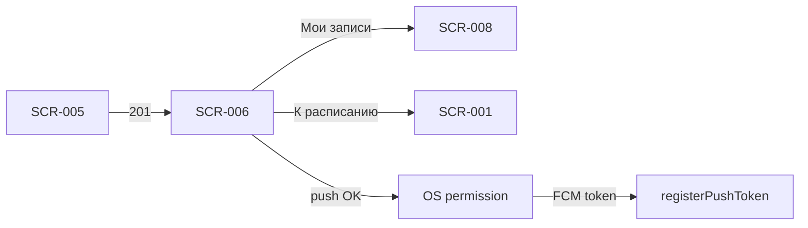

# Успешная запись

**ID:** SCR-006  
**Тип:** Экран  
**Домен:** 02. Бронирование  
**Приоритет:** Critical  
**Статус:** Актуален  
**Сессия клиента:** ClientSession — Bearer после первой записи (`sessionToken` из ответа `createBooking`)  
**Дизайн-макет:** Figma — TBD · **Design brief:** [SCR-006-booking-success.md](SCR-006-booking-success.md)

> **Платформа:** Android (NFR-001) · **Язык UI:** только русский (NFR-008) · **Оплата:** на месте (FR-012).

---

## Содержание

- [Обзор](#обзор)
- [Навигация](#навигация)
- [Входные данные](#входные-данные)
- [Применяемые логики](#применяемые-логики)
- [Инициализация](#инициализация)
- [Используемые запросы](#используемые-запросы)
- [Макет экрана](#макет-экрана)
- [Элементы экрана](#элементы-экрана)
- [Состояния экрана](#состояния-экрана)
- [Сценарии](#сценарии)
- [Связанные требования](#связанные-требования)
- [Критерии приёмки](#критерии-приёмки)

---

## Обзор

Экран подтверждает клиенту успешное создание брони на занятие в гончарной мастерской «Глина» после ответа `createBooking` (201). Показывает **сводку занятия и цену** с явной подписью «К оплате на месте». После **первой успешной записи** на устройстве — блок запроса push-разрешения (FR-024). Закрывает успешную ветку FR-009 и задаёт следующий шаг: просмотр «Мои записи» или возврат к расписанию.

Полноэкранный success-state предпочтительнее modal — ясное завершение потока записи.

### User Story

> Как клиент, я хочу увидеть подтверждение записи и сводку занятия, чтобы быть уверенным, что бронь создана, и перейти к следующему действию.

**Не в MVP:** лист ожидания при `NO_SPOTS` (FR-011) — только возврат к расписанию; фильтр по мастеру; iOS.

---

## Навигация

### Входящая

| Источник | Триггер | Условие | Параметры |
| :-- | :-- | :-- | :-- |
| SCR-005 | Успешный `createBooking` | HTTP 201 | `bookingId`, `booking`, `slot`, `isFirstBooking` |

### Исходящая

| Назначение | Триггер | Параметры |
| :-- | :-- | :-- |
| SCR-008 | CTA «Мои записи» | — (вкладка «Мои записи») |
| SCR-001 | CTA «К расписанию» | — (вкладка «Расписание») |
| SCR-001 | Системная кнопка «Назад» | **Сброс стека** — не возврат на SCR-005 |
| OS | CTA «Включить уведомления» | Системный диалог push-разрешения Android |
| OS | «Добавить в календарь» (Could) | Intent в календарь с адресом мастерской |

> **Нижняя навигация:** 2 вкладки — «Расписание» (SCR-001) | «Мои записи» (SCR-008). Отдельной вкладки «Профиль» нет.

> **Сброс back stack:** при любом выходе с SCR-006 форма SCR-005 **не** остаётся в стеке — избежать повторного submit. Если экран реализован как modal поверх SCR-005, при закрытии всё равно выполняется сброс стека до SCR-001 или SCR-008.

---

## Входные данные

| Название | Тип | Источник | Описание |
| :-- | :-- | :-- | :-- |
| `bookingId` | uuid | Навигация / `createBooking` | Идентификатор созданной брони |
| `booking` | Booking | API `createBooking` 201 | Полный объект брони: статус, цена, экипировка |
| `booking.totalPrice` | integer | API `createBooking` | **Источник истины** для отображения суммы на экране |
| `booking.equipment` | object | API `createBooking` | Режим OWN / RENTAL и выбранные позиции проката |
| `booking.status` | enum | API `createBooking` | `ACTIVE` → бейдж «Записан» |
| `slot` | SlotDetail | Передано из SCR-005 / `createBooking` | Дата, программа, мастер, длительность для сводки |
| `sessionToken` | string | API `createBooking` | Сохранить локально при первой записи |
| `isFirstBooking` | boolean | Локально / навигация | Первая успешная бронь на устройстве |
| `pushPermissionRequested` | boolean | Локальное хранилище | Флаг: системный запрос push уже показывался |

---

## Применяемые логики

| Логика | Элемент / триггер | Описание |
| :-- | :-- | :-- |
| [LOGIC-003_Цена-занятия](../../5-mobile-app-spec/09_Логики/LOGIC-003_Цена-занятия.md) | Блок «К оплате на месте» | Сумма из `booking.totalPrice`; прокат не влияет на цену |
| [LOGIC-007_Запрос-push-разрешения](../../5-mobile-app-spec/09_Логики/LOGIC-007_Запрос-push-разрешения.md) | Блок «Напоминания о занятии» | Показ только при первой записи; CTA → системный диалог → `registerPushToken` |

---

## Инициализация

### Запросы при открытии

| № | operationId | Критичный | Условие |
| :-: | :-- | :--: | :-- |
| — | — | — | **GET не выполняется.** Данные передаются из ответа `createBooking` (201) через навигацию |

> Экран открывается только после успешного `createBooking`. Инициализация — из параметров навигации и локальных флагов (`isFirstBooking`, `pushPermissionRequested`).

---

## Используемые запросы

### createBooking (входящий, выполнен на SCR-005)

**Метод:** POST  
**Путь:** `/bookings`  
**Спецификация:** [../../api/openapi.yaml](../../api/openapi.yaml) → `createBooking`

**Обработка ответа (контекст перехода на SCR-006):**

| HTTP / код | UI-реакция |
| :-- | :-- |
| 201 + data | Переход на SCR-006; передать `booking`, `slot`, `isFirstBooking`; сохранить `sessionToken` |
| 4xx / 5xx | SCR-007 (не SCR-006) |

**Доменные коды createBooking:** `NO_SPOTS`, `ALREADY_BOOKED_TODAY`, `SLOT_CANCELLED`, `RENTAL_UNAVAILABLE`, `SLOT_REBOOK_FORBIDDEN`.

---

### registerPushToken

**Метод:** POST  
**Путь:** `/profile/push-token`  
**Спецификация:** [../../api/openapi.yaml](../../api/openapi.yaml) → `registerPushToken`

**Тело запроса:**

```json
{ "token": "<FCM>", "platform": "android" }
```

**Обработка ответа:**

| HTTP / код | UI-реакция |
| :-- | :-- |
| 204 | Токен зарегистрирован; UI не прерывается |
| 401 / 400 / 500 | Ошибка логируется; навигация с SCR-006 работает штатно |

> Вызывается **асинхронно** после разрешения push в системном диалоге Android. Не блокирует CTA «Мои записи» / «К расписанию».

---

## Макет экрана

```
┌─────────────────────────────────┐
│                                 │
│         ✓ (иконка успеха)       │
│                                 │
│      Вы записаны!               │
│                                 │
├─────────────────────────────────┤
│ Сводка брони                    │
│ 📅 Ср, 9 июля · 18:00           │
│ ⏱ ~2,5 ч                        │
│ 🏺 Лепка для новичков           │
│ 👤 Мастер: Анна                 │
│ 🎒 Со своим / Прокат:           │
│    инструменты, фартук          │
│ 💰 К оплате на месте: 2 800 ₽   │
│ [ Записан ]                     │
├─────────────────────────────────┤
│ 🔔 Напоминания о занятии        │  ← только первая запись
│ Мы напомним за день и за 2 ч,   │
│ сообщим об отмене и переносе.   │
│ [ Включить уведомления ]        │
│ [ Не сейчас ]                   │
├─────────────────────────────────┤
│ [ Добавить в календарь ]        │  ← Could
├─────────────────────────────────┤
│ [ Мои записи ]    (primary)     │
│ [ К расписанию ]  (secondary)   │
└─────────────────────────────────┘
```

---

## Элементы экрана

| Элемент | Описание | Источник данных | Валидация / поведение |
| :-- | :-- | :-- | :-- |
| Иконка успеха | Галочка / лёгкая анимация подтверждения | Локально | Дублируется текстом заголовка (a11y) |
| Заголовок | «Вы записаны!» или «Запись подтверждена» | Локально | Focus при появлении экрана |
| Сводка брони | Дата, время, длительность, программа, мастер, экипировка | `slot.*`, `booking.equipment` | Дата/время — крупнее остального |
| Бейдж «Записан» | Статус брони | `booking.status` | Согласован со статусами SCR-008 |
| Строка экипировки | OWN или перечень проката | `booking.equipment.mode` | OWN → «Со своим (инструменты и фартук)»; RENTAL → «Прокат: …» |
| Блок цены | Сумма к оплате на месте | `booking.totalPrice` | Формат «К оплате на месте: X ₽»; без разбивки проката |
| Блок push-разрешения | Объяснение типов уведомлений FR-024 | Локально + [LOGIC-007](../../5-mobile-app-spec/09_Логики/LOGIC-007_Запрос-push-разрешения.md) | Только при `isFirstBooking` и `pushPermissionRequested = false` |
| CTA «Включить уведомления» | Запуск системного запроса push | Локально | Без технического жаргона «FCM» / «push-токен» |
| CTA «Не сейчас» | Пропуск запроса | Локально | Скрывает блок; без nag-screen при повторном SCR-006 |
| Подпись «Мы напомним о занятии» | Для клиентов с уже выданным разрешением push | OS permission | Показывается вместо блока push |
| CTA «Мои записи» | Primary — переход к списку с новой записью | Навигация | Сброс стека; SCR-008 с новой бронью вверху |
| CTA «К расписанию» | Secondary — возврат к поиску занятий | Навигация | Сброс стека до SCR-001 |
| «Добавить в календарь» | Intent в календарь OS с адресом мастерской | Локально + `slot` | Could; скрыть при недоступности intent |

**Терминология:** **мастер**, **занятие**, **программа**; прокат (инструменты, фартук) **не влияет на цену** (FR-012).

**Критерии для дизайнера:**

- Тон экрана — позитивный, тёплый (гончарная мастерская); избегать излишней «праздничной» анимации.
- Сводка — карточка с чёткой иерархией: **дата/время крупнее** остального; программа и мастер — вторичный уровень.
- Два основных CTA: primary «Мои записи», secondary «К расписанию» — не конкурируют визуально.
- «Добавить в календарь» — tertiary, Could; можно отложить без блокировки MVP.
- Safe area; на маленьких экранах сводка скроллится, CTA остаются внизу.
- После успеха бэкенд отправляет push «подтверждение записи» (FR-024) — можно упомянуть в подписи для клиентов с разрешением.

---

## Состояния экрана

| Состояние | Условие | Отображение |
| :-- | :-- | :-- |
| Content (успех, своё) | `equipment.mode = OWN` | Сводка: «Со своим (инструменты и фартук)» |
| Content (успех, прокат) | `equipment.mode = RENTAL` | «Прокат: инструменты, фартук» (перечень выбранного) |
| Push primer | `isFirstBooking = true`, push не запрашивался | Блок «Напоминания о занятии» + CTA |
| Push hidden (повторная запись) | Не первая бронь | Блок push **скрыт** |
| Push granted | OS permission granted | Блок push скрыт; подпись «Мы напомним о занятии» |
| Push denied | Permission denied после выбора | Блок скрыт; без повторного запроса на этом экране |
| Calendar available | OS поддерживает intent | Кнопка «Добавить в календарь» активна |
| Calendar unavailable | Ошибка / отказ intent | Кнопка скрыта или toast «Не удалось добавить» |

> Единственное основное состояние — **Content (успех)** после 201; ошибки обрабатываются на SCR-007. SCR-006 **не** входит в сквозной паттерн Loading/Empty/Error — см. [LOGIC-008](../../5-mobile-app-spec/09_Логики/LOGIC-008_Паттерн-состояний-экрана.md).

---

## Сценарии

1. **Проверить запись:** успех → «Мои записи» → SCR-008 (новая бронь вверху со статусом «Записан»).
2. **Записаться ещё (другой день):** успех → «К расписанию» → SCR-001. На тот же день повторная запись невозможна (FR-010).
3. **Первая запись + push:** успех → блок уведомлений → «Включить уведомления» → системный диалог → разрешено → `registerPushToken` → подпись «Мы напомним…» → CTA внизу.
4. **Первая запись, отказ push:** «Не сейчас» → блок скрывается → клиент может перейти в «Мои записи»; push можно включить позже в настройках OS.
5. **Календарь (Could):** тап «Добавить в календарь» → событие с названием программы, временем, адресом мастерской «Глина».
6. **Системная «Назад»:** сброс стека до SCR-001 — **не** возврат на SCR-005 (избежать повторного submit).



---

## Связанные требования

| ID | Связь |
| :-- | :-- |
| FR-009 | Подтверждение успешного бронирования после ответа бэкенда |
| FR-010 | Повторная запись на тот же день невозможна — контекст для CTA «К расписанию» |
| FR-012 | Сводка содержит цену занятия; явно «К оплате на месте»; прокат не влияет на сумму |
| FR-024 | Запрос push после первой записи; типы: напоминание за день, за 2 ч, подтверждение записи, отмена, перенос |
| NFR-010 | Только push, Android |
| UC-002 | Успешное завершение сценария записи |
| US-007 | Пользователь получает подтверждение брони |
| US-008 | Клиент видит цену и понимает оплату на месте |

---

## Критерии приёмки

| ID | Критерий |
| :-- | :-- |
| AC-001 | **Дано** `createBooking` вернул 201, **Когда** открывается SCR-006, **Тогда** отображаются иконка успеха, заголовок «Вы записаны!» и сводка с датой, программой, мастером и `booking.totalPrice`. |
| AC-002 | **Дано** `booking.equipment.mode = RENTAL`, **Когда** экран отрисован, **Тогда** в сводке указан перечень выбранного проката; цена не включает стоимость проката. |
| AC-003 | **Дано** `isFirstBooking = true` и push ещё не запрашивался, **Когда** SCR-006 в Content, **Тогда** показан блок «Напоминания о занятии» с CTA «Включить уведомления» и «Не сейчас». |
| AC-004 | **Дано** клиент нажал «Включить уведомления» и разрешил push в OS, **Когда** получен FCM-токен, **Тогда** асинхронно вызывается `registerPushToken` с `platform: android`; ошибки API не блокируют навигацию. |
| AC-005 | **Дано** это не первая бронь на устройстве, **Когда** SCR-006 открыт, **Тогда** блок push-разрешения **скрыт**. |
| AC-006 | **Дано** пользователь на SCR-006, **Когда** нажата системная «Назад» или CTA «К расписанию», **Тогда** выполняется переход в SCR-001 **без** возврата на SCR-005. |
| AC-007 | **Дано** пользователь на SCR-006, **Когда** нажат CTA «Мои записи», **Тогда** выполняется переход в SCR-008; новая бронь отображается со статусом «Записан». |
| AC-008 | **Дано** push уже разрешён в OS, **Когда** SCR-006 открыт после первой записи, **Тогда** блок primer скрыт и показана подпись «Мы напомним о занятии». |
