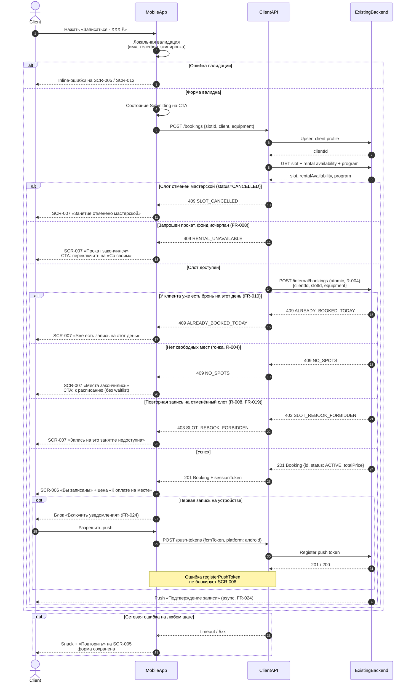

# API Sequence — createBooking

> Этап проектирования. Источники: [data-model.md](data-model.md), UC-002, FR-006–FR-012, FR-019, FR-025, R-004;
> [customer-questions.md](../1-elicitation/customer-questions.md), [SCR-005-booking-form.md](../3-design-brief/screens/SCR-005-booking-form.md).
>
> Диаграмма описывает поток **создания брони** из клиентского приложения через Client API в Existing Backend.

---

## 1. Участники

| Участник | Описание |
| :-- | :-- |
| **Client** | Пользователь (клиент гончарной мастерской) |
| **MobileApp** | Клиентское Android-приложение (SCR-005 → SCR-006 / SCR-007) |
| **ClientAPI** | API слоя клиентского приложения (контракт для mobile) |
| **ExistingBackend** | Существующий бэкенд мастерской — black-box, источник истины (R-004) |

---

## 2. Предусловия

- Клиент выбрал слот с `free_spots > 0` и `status = OPEN` (UC-002).
- На SCR-005 заполнены: контакты (имя, телефон — SCR-012), выбор экипировки (своё / прокат).
- У клиента нет другой активной записи на этот календарный день (FR-010).

**Загрузка экрана SCR-005 (до submit):**

| Запрос | Назначение |
| :-- | :-- |
| `GET /slots/{slotId}` | Сводка занятия, цена, `free_spots` |
| `GET /profile` | Контакты, `isRegularClient` (404 → первая запись) |
| `GET /slots/{slotId}/rental-availability` | Состояние проката; при `rentalFullyExhausted` — только «Со своим» на форме |

---

## 3. Диаграмма последовательности (с ветками)



---

## 4. Описание шагов

### 4.1. Локальная валидация (MobileApp)

| Шаг | Проверка | Результат |
| :-- | :-- | :-- |
| Имя | Непустое (FR-006) | Ошибка на SCR-005 / SCR-012 |
| Телефон | Формат +7, 10 цифр | Ошибка на SCR-005 / SCR-012 |
| Экипировка | Выбран `mode`; при `RENTAL` — хотя бы инструменты или фартук | Ошибка на SCR-005 |
| Прокат исчерпан | При `rentalFullyExhausted` на форме — только `OWN` | Radio «Прокат» disabled (FR-008) |

### 4.2. Upsert профиля (ClientAPI → Backend)

- Сохранить `Client.name`, `Client.phone` при первой записи или изменении (FR-006).
- Возвращает `clientId`; при успехе create — также `sessionToken` для последующих запросов.

### 4.3. Pre-check слота (ClientAPI)

- Повторное чтение `Slot`, `RentalAvailability`, `Program` перед атомарным create.
- Ранний отказ при `status = CANCELLED` → `409 SLOT_CANCELLED`.
- При `equipment.mode = RENTAL` и исчерпанном фонде — `409 RENTAL_UNAVAILABLE` (клиент может повторить с `OWN` на SCR-005).

### 4.4. Атомарное создание (ExistingBackend, R-004)

Бэкенд в одной транзакции:
1. Блокирует слот.
2. Проверяет `free_spots > 0` и доступность гончарных кругов.
3. Проверяет лимит **1 бронь/день** на клиента (FR-010).
4. Проверяет запрет повторной записи на `CANCELLED` слот (R-008, FR-019).
5. При `equipment.mode = RENTAL` — проверяет прокатный фонд (инструменты, фартук).
6. Применяет **приоритет записи** для постоянных клиентов при гонке (FR-025) — на стороне бэкенда.
7. Создаёт `Booking` со статусом `ACTIVE`, `total_price` = цена программы; уменьшает `free_spots`.

---

## 5. Коды ответов Client API

| HTTP | Код | Условие | UI |
| :--: | :-- | :-- | :-- |
| 201 | — | Бронь создана | SCR-006 |
| 400 | `VALIDATION_ERROR` | Невалидное тело запроса | SCR-005 / SCR-012 inline |
| 403 | `SLOT_REBOOK_FORBIDDEN` | Слот ранее отменён мастерской | SCR-007 |
| 409 | `NO_SPOTS` | Мест нет (гонка) | SCR-007 → SCR-001 |
| 409 | `ALREADY_BOOKED_TODAY` | Уже есть бронь на дату | SCR-007 |
| 409 | `SLOT_CANCELLED` | Занятие отменено мастерской | SCR-007 |
| 409 | `RENTAL_UNAVAILABLE` | Прокат исчерпан при `mode=RENTAL` | SCR-007 → «Со своим» на SCR-005 |
| 5xx / timeout | `SERVER_ERROR` | Ошибка бэкенда / сеть | Retry на SCR-005 |

> **Примечание:** лист ожидания **не** предусмотрен (FR-011). При `NO_SPOTS` — только возврат к расписанию.

---

## 6. Тело запроса POST /bookings

```json
{
  "slotId": "uuid",
  "client": {
    "name": "Иван",
    "phone": "+79001234567"
  },
  "equipment": {
    "mode": "RENTAL",
    "rentalTools": true,
    "rentalApron": true
  }
}
```

---

## 7. Тело ответа 201 Created

```json
{
  "id": "uuid",
  "slotId": "uuid",
  "status": "ACTIVE",
  "totalPrice": 2800.00,
  "equipment": {
    "mode": "RENTAL",
    "rentalTools": true,
    "rentalApron": true
  },
  "slot": {
    "startsAt": "2026-07-09T18:00:00+03:00",
    "program": {
      "name": "Лепка для начинающих",
      "typeName": "Лепка"
    },
    "master": {
      "fullName": "Анна К.",
      "avgRating": 4.8
    }
  },
  "createdAt": "2026-07-03T10:00:00+03:00",
  "sessionToken": "eyJhbGciOiJIUzI1NiIsInR5cCI6IkpXVCJ9..."
}
```

---

## 8. Связанные сценарии

| Сценарий | Документ |
| :-- | :-- |
| Отмена брони клиентом (≥ 3 ч / < 3 ч) | UC-004, FR-014–FR-015 |
| Отмена занятия мастерской | UC-005, FR-016–FR-018 |
| Перенос занятия | UC-006, FR-020 |
| Оценка мастера | UC-007, FR-021–FR-023 |
| Регистрация push-токена | SCR-006, FR-024, NFR-010 |
