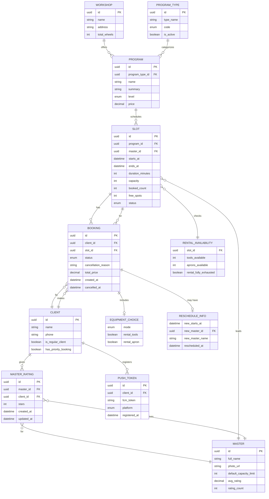
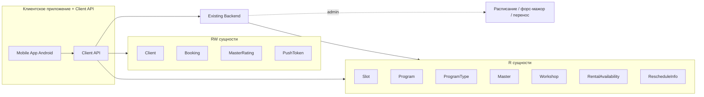

# Модель данных — гончарная мастерская «Глина»

> Этап проектирования. Источники: [domain-description.md](../1-elicitation/domain-description.md),
> [2-requirements/](../2-requirements/), [customer-questions.md](../1-elicitation/customer-questions.md),
> [brief-pottery.md](../0-customer-brief/brief-pottery.md) (R-004, R-008, R-015, R-027).
>
> Каноническая схема для клиентского контура — **контракт API** (R-015). Бэкенд мастерской — источник истины
> для расписания, учёта кругов и атомарности бронирования (R-004).

---

## 1. ER-диаграмма

---

## 2. Матрица доступа клиентского приложения

Обозначения:
- **R** — только чтение (данные приходят из бэкенда, приложение не изменяет)
- **RW** — чтение и запись через Client API (приложение инициирует изменение)

| Сущность | Доступ | Кто владеет данными | Операции клиента |
| :-- | :--: | :-- | :-- |
| **Workshop** (мастерская) | **R** | Бэкенд / админка | Просмотр названия, адреса |
| **ProgramType** (тип программы) | **R** | Бэкенд / админка | Фильтр расписания: лепка / работа на круге (FR-003) |
| **Program** (программа занятия) | **R** | Бэкенд / админка | Просмотр названия, описания, уровня, цены (FR-004, FR-012) |
| **Master** (мастер) | **R** | Бэкенд / админка | Просмотр; рейтинг — агрегат из оценок (FR-023) |
| **Slot** (слот / занятие) | **R** | Бэкенд / админка | Просмотр расписания; `free_spots` обновляет бэкенд |
| **RentalAvailability** (прокатный фонд) | **R** | Бэкенд / админка | Проверка проката инструментов и фартука на слот (FR-008) |
| **Client** (клиент / профиль) | **RW** | Client API + бэкенд | Upsert при первой записи (имя, телефон — FR-006) |
| **Booking** (бронь / запись) | **RW** | Client API + бэкенд | **Создание**; **отмена** клиентом; чтение своих записей |
| **EquipmentChoice** (экипировка) | **RW** | Часть Booking | Задаётся при создании брони (FR-007); не влияет на цену |
| **RescheduleInfo** (данные переноса) | **R** | Бэкенд | Отображение info-блока на SCR-009 при переносе (FR-020) |
| **MasterRating** (оценка мастера) | **RW** | Client API + бэкенд | Create/update после посещения (FR-021, FR-022) |
| **PushToken** (токен push) | **RW** | Client API + бэкенд | Регистрация FCM-токена после первой записи (FR-024, NFR-010) |

**Изменяются только бэкендом** (клиент лишь получает обновления):
- Статус слота при отмене / переносе занятия мастерской
- Статус брони → `CANCELLED_BY_WORKSHOP` + `cancellation_reason` (R-008, FR-016)
- Статус брони → `ATTENDED` после занятия
- `booked_count` / `free_spots` слота и учёт гончарных кругов
- `RescheduleInfo` при переносе времени или мастера (FR-020)
- Метка `is_regular_client` / `has_priority_booking` (FR-025) — устанавливается бэкендом

**Не в MVP (отсутствуют в модели клиента):**
- **WaitlistEntry** — лист ожидания не реализуется (FR-011)
- **AllergyProfile** — аллергии отсутствуют в домене «Глина»
- **WheelAssignment** — номер круга не показывается клиенту; учёт кругов — внутренняя логика бэкенда

---

## 3. Описание сущностей

### 3.1. Workshop (мастерская)

| Поле | Тип | Описание |
| :-- | :-- | :-- |
| `id` | UUID | Идентификатор |
| `name` | string | Название («Глина») |
| `address` | string | Адрес площадки (R-015) |
| `total_wheels` | int | Всего гончарных кругов (**10**) |

**Доступ:** R · **Источник:** domain §2, brief

---

### 3.2. ProgramType (тип программы)

| Поле | Тип | Описание |
| :-- | :-- | :-- |
| `id` | UUID | Идентификатор |
| `type_name` | string | Отображаемое имя: «Лепка», «Работа на круге» |
| `code` | enum | `CLAY` \| `WHEEL` — для фильтра SCR-003 |
| `is_active` | boolean | Доступен для фильтра |

**Доступ:** R · **Связи:** ProgramType 1—N Program · **Источник:** FR-003, domain §2

**Правило:** в UI бейдж типа — `program.typeName`; полное название занятия — `program.name` (SCR-004).

---

### 3.3. Program (программа занятия)

| Поле | Тип | Описание |
| :-- | :-- | :-- |
| `id` | UUID | Идентификатор |
| `program_type_id` | UUID FK | Тип программы для фильтра |
| `name` | string | Полное название («Лепка для начинающих») |
| `summary` | string | Краткое содержание занятия (SCR-004, FR-004) |
| `level` | enum | `BEGINNER` \| `INTERMEDIATE` \| `ADVANCED` — фильтр (FR-003) |
| `price` | decimal | Цена занятия (FR-012); прокат **не** влияет |

**Доступ:** R · **Источник:** domain §2–3, FR-012

---

### 3.4. Master (мастер)

| Поле | Тип | Описание |
| :-- | :-- | :-- |
| `id` | UUID | Идентификатор |
| `full_name` | string | ФИО |
| `photo_url` | string? | Фото |
| `default_capacity_limit` | int | Лимит группы для этого мастера: **до 6** на новичковые, **до 10** на круге (Q 2.1, Q 2.2) |
| `avg_rating` | decimal | Средний рейтинг (публичный, FR-023) |
| `rating_count` | int | Число оценок; при `0` — «Пока нет оценок» в UI |

**Доступ:** R · **Связи:** Master 1—N Slot · **Источник:** domain §2–3, FR-023

**Правило:** `Slot.capacity` определяется настройкой **мастера**, ведущего занятие, и типом программы (круг — до 10 свободных кругов).

---

### 3.5. Slot (слот / занятие)

| Поле | Тип | Описание |
| :-- | :-- | :-- |
| `id` | UUID | Идентификатор |
| `program_id` | UUID FK | Программа занятия |
| `master_id` | UUID FK | Мастер |
| `starts_at` | datetime | Начало |
| `ends_at` | datetime | Окончание |
| `duration_minutes` | int | Длительность **120–150** мин (~2–2,5 ч) |
| `capacity` | int | Вместимость (от мастера и типа программы) |
| `booked_count` | int | Занято мест |
| `free_spots` | int | Свободно мест |
| `status` | enum | `OPEN` \| `FULL` \| `CANCELLED` \| `RESCHEDULED` |

**Доступ:** R (клиент); изменение счётчиков и статуса — бэкенд · **Источник:** domain §2–3, FR-001–004, R-027

**Правила:**
- UI показывает только **«Есть места»** (`free_spots > 0`) / **«Мест нет»** (`free_spots = 0`); счётчик X/Y и номер круга **не показываются** (Q 2.7)
- `status = CANCELLED` — занятие отменено мастерской; повторная запись запрещена (R-008, FR-019)
- `status = FULL` или `free_spots = 0` — лист ожидания **не** предусмотрен (FR-011)
- `status = RESCHEDULED` — перенос времени/мастера (FR-020); клиент получает push и `rescheduleInfo` на брони

---

### 3.6. RentalAvailability (доступность проката на слот)

| Поле | Тип | Описание |
| :-- | :-- | :-- |
| `slot_id` | UUID FK | Слот |
| `tools_available` | int | Свободно комплектов инструментов |
| `aprons_available` | int | Свободно фартуков |
| `rental_fully_exhausted` | boolean | Прокат полностью исчерпан |

**Доступ:** R · **Источник:** FR-008, R-015

**Правило (FR-008):** при `rental_fully_exhausted = true` запись **возможна** при `equipment.mode = OWN`; слот **не блокируется**. При попытке `mode = RENTAL` — `409 RENTAL_UNAVAILABLE`.

---

### 3.7. Client (клиент)

| Поле | Тип | Описание |
| :-- | :-- | :-- |
| `id` | UUID | Идентификатор |
| `name` | string | Имя (FR-006) |
| `phone` | string | Телефон (FR-006) |
| `is_regular_client` | boolean | Метка постоянного клиента (FR-025) |
| `has_priority_booking` | boolean | Приоритет записи при гонке (FR-025) |

**Доступ:** RW · **Источник:** domain §2, FR-006, FR-025

---

### 3.8. Booking (бронь / запись)

| Поле | Тип | Описание |
| :-- | :-- | :-- |
| `id` | UUID | Идентификатор |
| `client_id` | UUID FK | Клиент |
| `slot_id` | UUID FK | Слот |
| `status` | enum | См. таблицу статусов ниже |
| `cancellation_reason` | string? | Причина при отмене мастерской (R-008) |
| `equipment` | EquipmentChoice | Вложенный выбор экипировки |
| `total_price` | decimal | Цена программы (оплата на месте) |
| `reschedule_info` | RescheduleInfo? | Данные переноса (если было) |
| `created_at` | datetime | Время создания |
| `cancelled_at` | datetime? | Время отмены |

**Статусы `Booking.status`:**

| Значение | Отображение в UI | Кто устанавливает |
| :-- | :-- | :-- |
| `ACTIVE` | «Записан» | Client API / бэкенд при create |
| `CANCELLED_BY_CLIENT` | «Отменена вами» | Client API при cancel |
| `CANCELLED_BY_WORKSHOP` | «Отменено мастерской» | Бэкенд (форс-мажор, R-008) |
| `ATTENDED` | «Посещена» | Бэкенд после занятия |

**Доступ:** RW · **Источник:** domain §2–3, FR-009–FR-020

**Правила:**
- Не более **1 активной брони в день** на клиента (FR-010) → `409 ALREADY_BOOKED_TODAY`
- Один участник на одну запись (FR-010)
- При отмене клиентом за **≥ 3 ч** место освобождается сразу (FR-014)
- Поздняя отмена (< 3 ч) — предупреждение о заготовленной глине; отмена разрешена, штрафов нет (FR-015)

---

### 3.9. EquipmentChoice (выбор экипировки)

Вложенный объект в `Booking`, не отдельная таблица в клиентском API.

| Поле | Тип | Описание |
| :-- | :-- | :-- |
| `mode` | enum | `OWN` \| `RENTAL` |
| `rental_tools` | boolean | Прокат инструментов |
| `rental_apron` | boolean | Прокат фартука |

**Доступ:** RW (при создании брони) · **Источник:** FR-007

**Правило:** выбор **не влияет на `total_price`** (FR-012).

---

### 3.10. RescheduleInfo (данные переноса)

Вложенный объект в `Booking`; устанавливается бэкендом при переносе занятия.

| Поле | Тип | Описание |
| :-- | :-- | :-- |
| `new_starts_at` | datetime | Новое время начала |
| `new_master_id` | UUID FK? | Новый мастер (если сменился) |
| `new_master_name` | string? | Имя нового мастера для UI |
| `rescheduled_at` | datetime | Момент переноса |

**Доступ:** R · **Источник:** FR-020

**Правило:** на SCR-009 info-блок переноса и warning «Отменено мастерской» **взаимоисключающие**.

---

### 3.11. MasterRating (оценка мастера)

| Поле | Тип | Описание |
| :-- | :-- | :-- |
| `id` | UUID | Идентификатор |
| `master_id` | UUID FK | Мастер |
| `client_id` | UUID FK | Клиент |
| `stars` | int | 1–5 (FR-021) |
| `created_at` | datetime | Первая оценка |
| `updated_at` | datetime | Последнее изменение |

**Доступ:** RW (create/update клиентом) · **Источник:** FR-021–FR-023

**Правила:**
- Только после `Booking.status = ATTENDED`
- Срок — **в течение недели** после занятия (FR-021)
- **Один клиент — одна оценка на мастера**; upsert при повторной отправке (FR-022)
- Без текстового отзыва в MVP
- Агрегируется в `Master.avg_rating`

---

### 3.12. PushToken (токен push-уведомлений)

| Поле | Тип | Описание |
| :-- | :-- | :-- |
| `id` | UUID | Идентификатор |
| `client_id` | UUID FK | Клиент |
| `fcm_token` | string | FCM-токен устройства |
| `platform` | enum | `android` (MVP) |
| `registered_at` | datetime | Время регистрации |

**Доступ:** RW · **Источник:** FR-024, NFR-010

**Правило:** регистрация асинхронно после первой успешной записи на SCR-006; ошибки не блокируют навигацию.

---

## 4. Ключевые связи и кардинальности

| Связь | Кардинальность | Комментарий |
| :-- | :-- | :-- |
| Workshop → Program | 1:N | |
| ProgramType → Program | 1:N | Фильтр «программа» (лепка / круг); multi-select OR |
| Master → Slot | 1:N | Лимит 6 / до 10 — на уровне мастера и типа программы |
| Program → Slot | 1:N | Цена — от программы |
| Client → Booking | 1:N | Макс. 1 ACTIVE в день (FR-010) |
| Slot → Booking | 1:N | Атомарная проверка мест и кругов (R-004) |
| Client → MasterRating | 1:N | Уникальность пара (client, master) |
| Master → MasterRating | 1:N | Агрегируется в `avg_rating` |
| Client → PushToken | 1:N | Один клиент — несколько устройств |
| Slot → RentalAvailability | 1:0..1 | Прокатный фонд на слот |

---

## 5. Граница Client API ↔ Existing Backend

**Existing Backend** создаёт и изменяет: Slot, Program, ProgramType, Master, Workshop, расписание, отмены/переносы мастерской, статус `ATTENDED`, `RescheduleInfo`, метки постоянного клиента, учёт гончарных кругов.

**Client API** создаёт и изменяет: Client (upsert), Booking (create/cancel), MasterRating (upsert), PushToken; проксирует чтение остальных сущностей.
