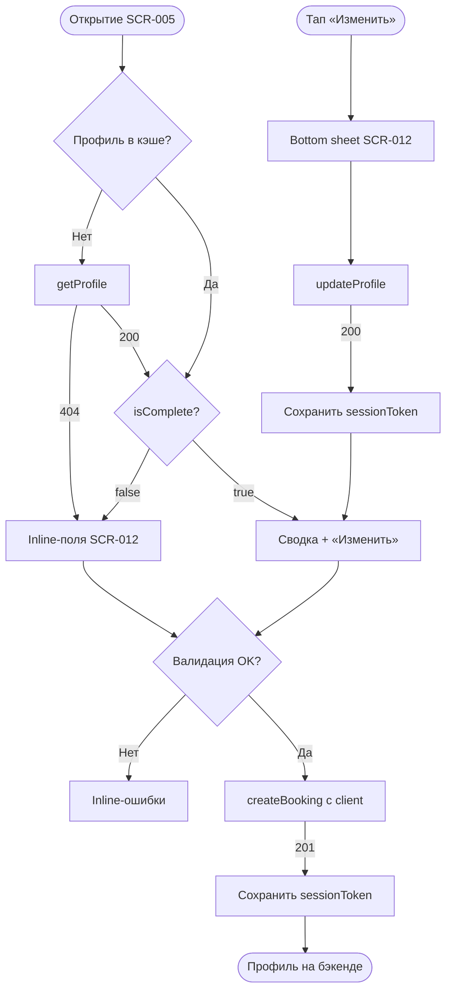

# LOGIC-001 — Контактный профиль

**ID:** LOGIC-001  
**Тип:** Логика  
**Приоритет:** Must  
**Статус:** Актуален

> **Продукт:** гончарная мастерская «Глина» · **Платформа:** Android · **Роль:** Клиент (R-028).  
> **API:** [../../api/openapi.yaml](../../api/openapi.yaml) · **Модель данных:** [../../4-design/data-model.md](../../4-design/data-model.md).

---

## Обзор

Управление контактными данными клиента (имя, телефон) при первой записи и при редактировании на [SCR-005](../../3-design-brief/screens/SCR-005-booking-form.md) / [SCR-012](../../3-design-brief/screens/SCR-012-contact-profile.md). Отдельного экрана входа и вкладки «Профиль» в MVP нет. Идентификация достаточна именем и телефоном; после upsert бэкенд выдаёт `sessionToken` для последующих запросов с `ClientSession`.

**Не хардкодить:** признак постоянного клиента, приоритет записи — только из API (`isRegularClient`, `hasPriorityBooking`).

---

## Точки применения

| Экран | Элемент / триггер |
| :-- | :-- |
| [SCR-005](../../3-design-brief/screens/SCR-005-booking-form.md) | Открытие формы, валидация перед submit, inline-секция контактов |
| [SCR-012](../../3-design-brief/screens/SCR-012-contact-profile.md) | Поля имя/телефон, бейдж «Постоянный клиент», bottom sheet «Изменить» |

---

## Флоу

---

## Описание логики

### Режимы отображения

| Условие | UI |
| :-- | :-- |
| `isComplete = false` или 404 `getProfile` | Inline-поля «Имя» и «Телефон» на SCR-005 (секция SCR-012) |
| `isComplete = true` | Сводка «{name} · +7 XXX ***-XX-XX» + ссылка «Изменить контакты» |
| `isRegularClient = true` | Бейдж «Постоянный клиент» (FR-025); приоритет записи применяется на бэкенде через `hasPriorityBooking` |

### Валидация

| Поле | Правило | Сообщение |
| :-- | :-- | :-- |
| Имя | Непустое, 2–50 символов после trim | «Укажите имя» |
| Телефон | Паттерн `^\+7\d{10}$` (Q 1.1) | «Введите корректный номер» |

Валидация выполняется:
1. **Локально** на SCR-005 перед отправкой `createBooking`.
2. **На сервере** — 400 `VALIDATION_ERROR` с `details[].field` (`client.name`, `client.phone`).

### Маска телефона

- Отображение: `+7 (XXX) XXX-XX-XX`.
- Хранение / API: нормализованный `+79001234567`.
- Автоподстановка префикса `+7`; поддержка вставки из буфера с нормализацией.

### Сохранение профиля

Два допустимых пути (не взаимоисключающих):

1. **Явный:** `updateProfile` (PATCH `/profile`) при «Сохранить» в bottom sheet SCR-012.
2. **Неявный:** upsert в составе `createBooking` — Client API сохраняет `Client.name`, `Client.phone` при первой записи или изменении контактов.

UI **обязан** гарантировать валидные контакты до `createBooking`. После успешного ответа **201** (`createBooking`) или **200** (`updateProfile`) — сохранить `sessionToken` из тела ответа для заголовка `Authorization: Bearer`.

### Офлайн

Если профиль не сохранён на сервере и нет сети — submit `createBooking` блокируется с сообщением о необходимости подключения.

**Терминология MVP:** **мастер**, **занятие / слот**, **программа** (лепка / круг).

**Вне MVP (не описывать в логике):** лист ожидания (FR-011), фильтр по мастеру, онлайн-оплата, email/пароль, iOS, штрафы за позднюю отмену.

---

## Входные / выходные данные

| Параметр | Тип | Направление | Описание |
| :-- | :-- | :--: | :-- |
| `profile.name` | string | in/out | Имя клиента |
| `profile.phone` | string | in/out | Телефон `+7XXXXXXXXXX` |
| `profile.isComplete` | boolean | in | Режим inline vs сводка |
| `profile.isRegularClient` | boolean | in | Показ бейджа «Постоянный клиент» (FR-025) |
| `profile.hasPriorityBooking` | boolean | in | Read-only; приоритет на бэкенде (FR-025) |
| `client` | `ClientContacts` | out | Тело `createBooking.client` |
| `sessionToken` | string | out | JWT после upsert (локальное хранение) |

**operationId:** `getProfile`, `updateProfile`, `createBooking` — см. [OpenAPI](../../api/openapi.yaml).

---

## Связанные требования

| ID | Описание |
| :-- | :-- |
| FR-006 | Запись с контактными данными (имя, телефон) |
| FR-025 | Метка постоянного клиента и приоритет записи |
| FR-028 | Операции профиля через Client API |
| UC-002 | Запись на занятие |
| Q 1.1 | Имя + телефон достаточно для идентификации |
| NFR-001 | Платформа Android |
| NFR-008 | Сообщения на русском |

---

## Критерии приёмки

| ID | Критерий |
| :-- | :-- |
| AC-L-001 | **Дано** пустой профиль (`isComplete = false`), **Когда** первая запись на SCR-005, **Тогда** требуются имя и телефон, CTA «Записаться» disabled до валидности полей. |
| AC-L-002 | **Дано** невалидный телефон (не `+7` и 10 цифр), **Когда** submit, **Тогда** inline-ошибка «Введите корректный номер», `createBooking` не отправляется. |
| AC-L-003 | **Дано** `isComplete = true`, **Когда** открыт SCR-005, **Тогда** сводка контактов вместо пустых полей, маска `+7 XXX ***-XX-XX`. |
| AC-L-004 | **Дано** `isRegularClient = true`, **Когда** отображается секция SCR-012, **Тогда** бейдж «Постоянный клиент» виден; цена занятия не меняется. |
| AC-L-005 | **Дано** первая успешная запись, **Когда** `createBooking` → 201, **Тогда** `sessionToken` сохранён локально для `ClientSession`. |
| AC-L-006 | **Дано** правка в bottom sheet SCR-012, **Когда** «Сохранить», **Тогда** вызывается `updateProfile`, сводка обновлена, `sessionToken` сохранён при наличии в ответе. |
