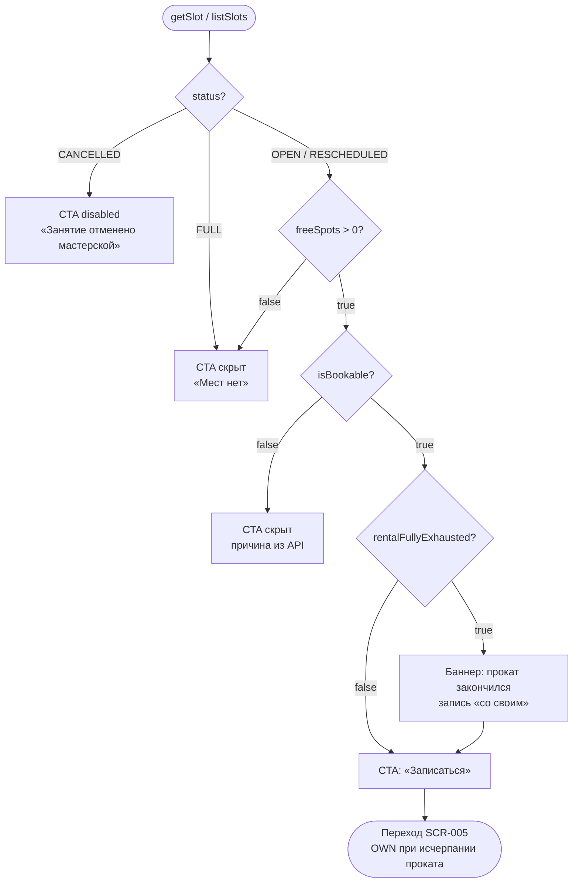

# LOGIC-002 — Доступность слота

**ID:** LOGIC-002  
**Тип:** Логика  
**Приоритет:** Must  
**Статус:** Актуален

> **Продукт:** гончарная мастерская «Глина» · **Платформа:** Android · **Роль:** Клиент (R-028).  
> **API:** [../../api/openapi.yaml](../../api/openapi.yaml) · **Модель данных:** [../../4-design/data-model.md](../../4-design/data-model.md).

---

## Обзор

Определяет доступность занятия для записи на основе полей `SlotDetail` / `SlotSummary` из API (`getSlot`, `listSlots`). Учитывает наличие мест (`freeSpots`), статус слота (`status`), флаг записи (`isBookable`) и состояние проката (`rentalAvailability`).

**Ключевое правило «Глина» (FR-008):** при `rentalAvailability.rentalFullyExhausted = true` слот **не блокируется** — CTA «Записаться» остаётся активной при наличии мест; ограничение «только со своим» применяется на SCR-005 ([LOGIC-009](LOGIC-009_Выбор-экипировки.md)).

**Не хардкодить:** лимиты групп, прокатный фонд — только из API (R-015, FR-026).

---

## Точки применения

| Экран | Элемент / триггер |
| :-- | :-- |
| [SCR-001](../../3-design-brief/screens/SCR-001-schedule.md) | Бейдж «Есть места» / «Мест нет» на карточке занятия |
| [SCR-004](../../3-design-brief/screens/SCR-004-session-detail.md) | CTA «Записаться», информационный баннер проката |
| [SCR-005](../../3-design-brief/screens/SCR-005-booking-form.md) | Pre-check перед submit `createBooking` |
| [SCR-007](../../3-design-brief/screens/SCR-007-booking-error.md) | Маппинг кодов `NO_SPOTS`, `SLOT_CANCELLED`, `RENTAL_UNAVAILABLE`, `SLOT_REBOOK_FORBIDDEN` |

---

## Флоу

---

## Описание логики

### Источник данных

Поля из схемы OpenAPI `SlotSummary` / `SlotDetail`:

| Поле | Тип | Назначение |
| :-- | :-- | :-- |
| `freeSpots` | integer (≥ 0) | Свободные места; UI: «Есть места» при `> 0`, «Мест нет» при `= 0` |
| `status` | SlotStatus | `OPEN`, `FULL`, `CANCELLED`, `RESCHEDULED` |
| `isBookable` | boolean | Итоговая доступность записи с учётом статуса |
| `rentalAvailability.rentalFullyExhausted` | boolean | Прокат полностью исчерпан (FR-008) |
| `rentalAvailability.toolsAvailable` | integer | Остаток комплектов инструментов (информативно) |
| `rentalAvailability.apronsAvailable` | integer | Остаток фартуков (информативно) |

**Клиенту не показывается** точное число свободных мест — только «Есть места» / «Мест нет» (FR-004, FR-011).

**Спецификация:** [../../api/openapi.yaml](../../api/openapi.yaml) → `getSlot`, `listSlots`.

### Правила CTA на SCR-004

| Условие | UI |
| :-- | :-- |
| `status = CANCELLED` | Пометка «Занятие отменено мастерской» (FR-016); CTA скрыт |
| `freeSpots = 0` или `status = FULL` | Бейдж «Мест нет»; CTA **скрыт** (FR-011, без waitlist) |
| `freeSpots > 0`, `status = OPEN`, `isBookable = true` | CTA **«Записаться»** **активна** |
| `rentalFullyExhausted = true` при активной CTA | Информационный баннер «Прокат на это время закончился. Можно записаться со своим снаряжением»; CTA **не скрывается** (FR-008) |
| `status = RESCHEDULED` | CTA активна при `freeSpots > 0` и `isBookable = true`; отображается пометка о переносе (FR-020) |

### Отображение на SCR-001

- Бейдж **«Есть места»** при `freeSpots > 0` и `isBookable = true`.
- Бейдж **«Мест нет»** при `freeSpots = 0` или `status = FULL`.
- Без числового счётчика «X/Y мест» и без номера гончарного круга.

### Pre-check на SCR-005

Перед `createBooking` клиент повторно запрашивает `getSlot` (api-sequence §4.3). Блокировать submit, если:
- `freeSpots = 0` или `status = FULL` → переход SCR-007 `NO_SPOTS`;
- `status = CANCELLED` → SCR-007 `SLOT_CANCELLED`;
- `isBookable = false` (прочие причины).

При `rentalFullyExhausted = true` submit **разрешён** с `equipment.mode = OWN`. Submit с `equipment.mode = RENTAL` при исчерпанном фонде → SCR-007 `RENTAL_UNAVAILABLE` (гонка; CTA «Записаться со своим»).

### Ошибки бронирования (связанные коды)

| ErrorCode | Смысл | UI (SCR-007) |
| :-- | :-- | :-- |
| `NO_SPOTS` | Места закончились (гонка, R-004) | «Места закончились» → к расписанию |
| `SLOT_CANCELLED` | Занятие отменено мастерской (R-008, FR-016) | «Занятие отменено мастерской» |
| `RENTAL_UNAVAILABLE` | Прокатный фонд исчерпан при `mode=RENTAL` | «Прокат закончился» → переключить на «Со своим» |
| `SLOT_REBOOK_FORBIDDEN` | Повторная запись на слот, отменённый мастерской (FR-019) | «Запись на это занятие недоступна» |

**Терминология MVP:** **мастер**, **занятие / слот**, **program** (лепка / круг).

**Вне MVP (не описывать в логике):** лист ожидания (FR-011), фильтр по мастеру, онлайн-оплата, iOS.

---

## Входные / выходные данные

| Параметр | Тип | Направление | Описание |
| :-- | :-- | :--: | :-- |
| `slotId` | uuid | Вход | Идентификатор слота |
| `freeSpots` | integer | Вход (API) | Число свободных мест |
| `status` | SlotStatus | Вход (API) | Статус слота |
| `isBookable` | boolean | Вход (API) | Флаг доступности записи |
| `rentalAvailability` | `RentalAvailability` | Вход (API) | Состояние прокатного фонда |
| `ctaVisible` | boolean | Выход | Показывать ли CTA «Записаться» |
| `ctaEnabled` | boolean | Выход | Активна ли CTA |
| `availabilityLabel` | string | Выход | «Есть места» \| «Мест нет» |
| `bannerMessage` | string? | Выход | Текст баннера при исчерпании проката |

**operationId:** `getSlot`, `listSlots`, `createBooking` — см. [OpenAPI](../../api/openapi.yaml).

---

## Связанные требования

| ID | Описание |
| :-- | :-- |
| FR-004 | Отображение «есть места» / «мест нет» на карточке |
| FR-008 | При исчерпании проката — запись только «со своим» |
| FR-009 | Результат бронирования: подтверждение или отказ |
| FR-011 | «Мест нет» без листа ожидания |
| FR-016 | Статус «Отменено мастерской» |
| FR-019 | Запрет повторной записи на отменённый мастерской слот |
| FR-026 | Данные слотов только из API |
| UC-002 | Выбор слота перед записью |
| R-004 | Атомарная резервация места на бэкенде |
| R-008 | Отмена занятия мастерской |

---

## Критерии приёмки

| ID | Критерий |
| :-- | :-- |
| AC-L-001 | **Дано** `freeSpots = 0`, **Когда** SCR-004, **Тогда** CTA «Записаться» скрыт, бейдж «Мест нет». |
| AC-L-002 | **Дано** `freeSpots > 0`, `isBookable = true`, `status = OPEN`, **Когда** SCR-004, **Тогда** CTA «Записаться» активна. |
| AC-L-003 | **Дано** `rentalFullyExhausted = true` и `freeSpots > 0`, **Когда** SCR-004, **Тогда** CTA активна, баннер о прокате виден, переход на SCR-005 с предвыбором «Со своим». |
| AC-L-004 | **Дано** `status = CANCELLED`, **Когда** SCR-004, **Тогда** CTA скрыт, текст «Занятие отменено мастерской». |
| AC-L-005 | **Дано** карточка на SCR-001, **Когда** отображается доступность, **Тогда** только «Есть места» / «Мест нет», без счётчика X/Y. |
| AC-L-006 | **Дано** submit с `equipment.mode = RENTAL` при исчерпанном прокате (гонка), **Когда** API → `RENTAL_UNAVAILABLE`, **Тогда** SCR-007 с предложением переключиться на «Со своим». |
