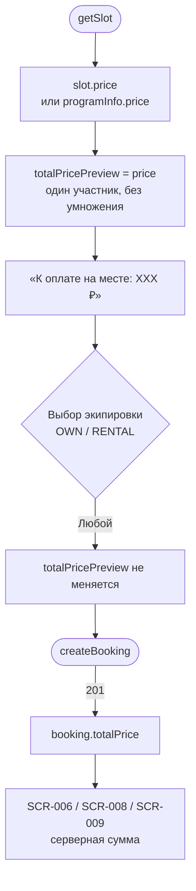

# LOGIC-003 — Расчёт цены брони

**ID:** LOGIC-003  
**Тип:** Логика  
**Приоритет:** Must  
**Статус:** Актуален

> **Продукт:** гончарная мастерская «Глина» · **Платформа:** Android · **Роль:** Клиент (R-028).  
> **API:** [../../api/openapi.yaml](../../api/openapi.yaml) · **Модель данных:** [../../4-design/data-model.md](../../4-design/data-model.md).

---

## Обзор

Расчёт и отображение стоимости брони: **цена программы за одного участника** (FR-010 — ровно 1 участник на запись, без stepper). Прокат экипировки **не влияет** на сумму (FR-012). Оплата **на месте в мастерской** — приложение не проводит онлайн-платёж. На SCR-005 показывается **клиентский превью-расчёт**; после успешного `createBooking` — **серверный** `booking.totalPrice` (источник истины, R-004).

**Не хардкодить:** цены программ — только из API (`slot.price`, `programInfo.price`).

---

## Точки применения

| Экран | Элемент / триггер |
| :-- | :-- |
| [SCR-004](../../3-design-brief/screens/SCR-004-session-detail.md) | «XXX ₽», подпись об оплате на месте |
| [SCR-005](../../3-design-brief/screens/SCR-005-booking-form.md) | Блок «К оплате на месте: XXX ₽», CTA «Записаться · XXX ₽» |
| [SCR-006](../../3-design-brief/screens/SCR-006-booking-success.md) | «К оплате на месте: XXX ₽» из `booking.totalPrice` |
| [SCR-008](../../3-design-brief/screens/SCR-008-my-bookings.md) | Сумма в карточке записи |
| [SCR-009](../../3-design-brief/screens/SCR-009-booking-detail.md) | Итоговая сумма записи |

---

## Флоу



---

## Описание логики

### Формула превью (SCR-004, SCR-005)

```
totalPricePreview = slot.price ?? programInfo.price
```

Где:
- `slot.price` — цена программы из `SlotSummary` / `SlotDetail`;
- `programInfo.price` — резервный источник из детальной карточки программы;
- **участник всегда один** (FR-010) — stepper отсутствует, умножение на `participantCount` **не применяется**.

Все значения **только из API** (R-015, FR-026). Хардкод тарифов запрещён.

### Участники

| Правило | Описание |
| :-- | :-- |
| Количество | Ровно **1** участник на бронь (FR-010) |
| UI | Stepper **не отображается** |
| Несколько записей в день | **Запрещено** — не более одной активной записи на календарный день (FR-010) |

### Прокат и цена

| Условие | Поведение |
| :-- | :-- |
| `equipment.mode = OWN` | Цена не меняется |
| `equipment.mode = RENTAL` | Цена **не меняется** (FR-012); проверка прокатного фонда — отдельно (LOGIC-002, LOGIC-009) |
| `rentalTools` / `rentalApron` | Не влияют на `totalPricePreview` |

### Правила отображения

| Условие | Поведение |
| :-- | :-- |
| `price = null` | Числовой блок суммы скрыт; подпись «Оплата на месте в мастерской» остаётся |
| После 201 | Показывать `booking.totalPrice`; **не** пересчитывать на клиенте |
| SCR-004 | «XXX ₽» — цена занятия из программы |
| SCR-005 CTA | «Записаться · XXX ₽» — `totalPricePreview` |

### Подпись UI

Обязательная строка на SCR-004 и SCR-005: **«Оплата на месте в мастерской»** (FR-012).

**Терминология MVP:** **мастер**, **занятие / слот**, **программа** (лепка / круг).

**Вне MVP (не описывать в логике):** онлайн-оплата, stepper участников, скидки, iOS.

---

## Входные / выходные данные

| Параметр | Тип | Направление | Описание |
| :-- | :-- | :--: | :-- |
| `slot.price` | decimal? | Вход (API) | Цена программы на слоте |
| `programInfo.price` | decimal? | Вход (API) | Цена из деталей программы |
| `equipment.mode` | `OWN` \| `RENTAL` | Вход | Не влияет на сумму |
| `totalPricePreview` | decimal? | Выход | Превью для SCR-004 / SCR-005 |
| `booking.totalPrice` | decimal | Выход (API) | Серверный итог после 201 |

**operationId:** `getSlot`, `createBooking` — см. [OpenAPI](../../api/openapi.yaml).

---

## Связанные требования

| ID | Описание |
| :-- | :-- |
| FR-004 | Отображение цены на карточке занятия |
| FR-007 | Выбор своего или прокатного снаряжения |
| FR-008 | Прокат не блокирует запись; не влияет на цену |
| FR-010 | Один участник и одна запись в день |
| FR-012 | Цена от программы; оплата на месте; прокат не влияет |
| UC-002 | Оформление записи на занятие |
| R-004 | Сервер — источник истины по сумме брони |
| R-015 | Числа только из API |

---

## Критерии приёмки

| ID | Критерий |
| :-- | :-- |
| AC-L-001 | **Дано** `slot.price = 2800`, **Когда** SCR-005, **Тогда** `totalPricePreview = 2800 ₽`, stepper участников отсутствует. |
| AC-L-002 | **Дано** выбран прокат инструментов и фартука (`mode = RENTAL`), **Когда** меняется экипировка, **Тогда** `totalPricePreview` **не** меняется. |
| AC-L-003 | **Дано** успешный `createBooking` → 201 с `totalPrice = 2800`, **Когда** SCR-006, **Тогда** отображается «К оплате на месте: 2 800 ₽» из `booking.totalPrice`, а не пересчёт клиента. |
| AC-L-004 | **Дано** `slot.price = null` и `programInfo.price = null`, **Когда** SCR-005, **Тогда** числовой блок скрыт, строка «Оплата на месте в мастерской» видна. |
| AC-L-005 | **Дано** SCR-004 с `price = 3500`, **Когда** экран загружен, **Тогда** отображается «3 500 ₽» и подпись об оплате на месте. |
| AC-L-006 | **Дано** запись в SCR-008 / SCR-009, **Когда** карточка отображает сумму, **Тогда** используется `booking.totalPrice` с сервера без клиентского пересчёта. |
