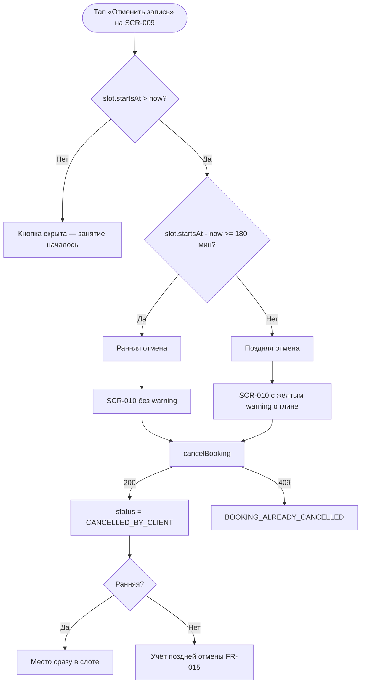

# LOGIC-004 — Отмена: правило 3 часов

**ID:** LOGIC-004  
**Тип:** Логика  
**Приоритет:** Must  
**Статус:** Актуален

> **Продукт:** гончарная мастерская «Глина» · **Платформа:** Android · **Роль:** Клиент (R-028).
> **API:** [../api/openapi.yaml](../api/openapi.yaml) · **Модель данных:** [../4-design/data-model.md](../4-design/data-model.md).

---

## Обзор

Классификация отмены активной брони клиентом на **раннюю** (≥ 3 ч до начала занятия) и **позднюю**
(< 3 ч до начала). Логика определяет:

- показ предупреждающего блока на [SCR-010](../../3-design-brief/screens/SCR-010-cancel-confirm.md);
- видимость кнопки «Отменить запись» на [SCR-009](../../3-design-brief/screens/SCR-009-booking-detail.md);
- ожидаемое поведение бэкенда при вызове `cancelBooking`.

В MVP: при поздней отмене показывается **предупреждение о заготовленной глине**, но отмена **не блокируется**; штрафов нет (FR-015). При ранней отмене место в слоте освобождается **сразу** (FR-014).

**Не хардкодить:** порог 3 ч — бизнес-константа домена; лимиты групп, прокатный фонд, цены — только из API (R-015, FR-026).

---

## Точки применения

| Экран | Элемент / триггер |
| :-- | :-- |
| [SCR-009](../../3-design-brief/screens/SCR-009-booking-detail.md) | Кнопка «Отменить запись» — при `canCancel` / `ACTIVE` и занятие в будущем |
| [SCR-010](../../3-design-brief/screens/SCR-010-cancel-confirm.md) | Блок предупреждения; расчёт `isLateCancellation` |

> Ссылки на экраны — только в [3-design-brief/screens/](../../3-design-brief/screens/).

---

## Флоу



---

## Описание логики

### Входные данные

| Параметр | Тип | Источник | Описание |
| :-- | :-- | :-- | :-- |
| `slot.startsAt` | datetime (ISO 8601) | `getBooking` | Время начала занятия |
| `now` | datetime | Локальное время устройства | Текущий момент |
| `status` | `BookingStatus` | `getBooking` | Должен быть `ACTIVE` |
| `canCancel` | boolean | `getBooking` | Серверный флаг: `ACTIVE` и занятие в будущем |

### Формулы

```
minutesUntilStart = (slot.startsAt - now) в минутах

canCancel = status == ACTIVE AND minutesUntilStart > 0
         (дублируется серверным полем getBooking.canCancel)

isEarlyCancel = canCancel AND minutesUntilStart >= 180

isLateCancel  = canCancel AND minutesUntilStart < 180

showWarning   = isLateCancel
```

> Порог **180 минут (3 часа)** — FR-014, FR-015. Граница включительна для ранней отмены: ровно 3 ч = ранняя.

### Правила классификации

| Тип | Условие | UI (SCR-010) | Бэкенд (`cancelBooking`) |
| :-- | :-- | :-- | :-- |
| **Недоступна** | `minutesUntilStart <= 0` | Кнопка «Отменить» скрыта на SCR-009 | — |
| **Ранняя** | `minutesUntilStart >= 180` | Sheet без жёлтого блока | 200; `isLateCancellation: false`; место освобождается сразу (FR-014) |
| **Поздняя** | `0 < minutesUntilStart < 180` | Sheet с warning-блоком о глине | 200; `isLateCancellation: true`; штрафов нет (FR-015) |

### Текст предупреждения (поздняя отмена)

> До начала занятия осталось меньше 3 часов. Глина для занятия уже заготовлена.

- Фон: warning (жёлтый), **не** error.
- Без упоминания штрафов и без блокировки кнопки «Отменить запись».

### Ограничения MVP

| Правило | Описание |
| :-- | :-- |
| Блокировка | Поздняя отмена **разрешена** |
| Штрафы | Отсутствуют (FR-015) |
| Офлайн | Отмена недоступна без сети; кнопка на SCR-009 disabled |
| Повторная отмена | `409 BOOKING_ALREADY_CANCELLED` — обновление UI |
| Лист ожидания | **Не применяется** — освободившееся место доступно для новой записи |

### Отмена мастерской

Статус `CANCELLED_BY_WORKSHOP` устанавливает **бэкенд** (UC-005, FR-016). Клиент **не** может отменить такую бронь повторно; отображается причина `cancellationReason` (R-008). CTA «Отменить запись» для этого статуса **скрыт**.

**Терминология MVP:** **мастер** (не «инструктор»), **занятие / слот**, **программа** (лепка / круг), **мастерская**.

**Вне MVP (не описывать в логике):** лист ожидания (FR-011), фильтр по мастеру, онлайн-оплата, аллергии, текстовые отзывы, iOS, штрафы за позднюю отмену.

---

## Входные / выходные данные

| Параметр | Тип | Направление | Описание |
| :-- | :-- | :--: | :-- |
| `slot.startsAt` | datetime | Вход | Время начала слота |
| `status` | `BookingStatus` | Вход | Статус брони |
| `canCancel` | boolean | Вход/Выход | Можно ли показать кнопку отмены |
| `isEarlyCancel` | boolean | Выход | `true` если ≥ 180 мин до старта |
| `isLateCancel` | boolean | Выход | `true` если 0 < минут < 180 |
| `showWarning` | boolean | Выход | Жёлтый блок на SCR-010 (= `isLateCancel`) |
| `isLateCancellation` | boolean | Выход | Из ответа `cancelBooking` |

**operationId:** `cancelBooking` — см. [bookings.yaml](../api/paths/bookings.yaml).

---

## Связанные требования

| ID | Описание |
| :-- | :-- |
| UC-004 | Отмена записи клиентом |
| FR-014 | Ранняя отмена ≥ 3 ч — место сразу освобождается |
| FR-015 | Поздняя отмена < 3 ч — предупреждение о глине; отмена разрешена |
| FR-016 | Отмена мастерской — `CANCELLED_BY_WORKSHOP` |
| US-010 | Отмена заблаговременно (≥ 3 ч) |
| US-011 | Предупреждение при поздней отмене (< 3 ч) |
| NFR-008 | Тексты на русском |
| NFR-009 | Офлайн — отмена недоступна |

---

## Критерии приёмки

| ID | Критерий |
| :-- | :-- |
| AC-L-001 | **Дано** до `slot.startsAt` осталось 4 ч и `status = ACTIVE`, **Когда** открыт SCR-010, **Тогда** warning-блок **не** показывается. |
| AC-L-002 | **Дано** до `slot.startsAt` осталось 90 мин и > 0, **Когда** открыт SCR-010, **Тогда** warning-блок о заготовленной глине виден и кнопка «Отменить запись» активна. |
| AC-L-003 | **Дано** `slot.startsAt <= now`, **Когда** открыт SCR-009, **Тогда** кнопка «Отменить запись» скрыта (`canCancel = false`). |
| AC-L-004 | **Дано** поздняя отмена подтверждена, **Когда** `cancelBooking`, **Тогда** 200, `isLateCancellation: true`, штраф не применяется. |
| AC-L-005 | **Дано** ранняя отмена (≥ 3 ч) подтверждена, **Когда** `cancelBooking`, **Тогда** 200, `isLateCancellation: false`, статус `CANCELLED_BY_CLIENT`. |
| AC-L-006 | **Дано** SCR-009 офлайн, **Когда** `status == ACTIVE`, **Тогда** кнопка отмены disabled, SCR-010 недоступен. |
| AC-L-007 | **Дано** `status = CANCELLED_BY_WORKSHOP`, **Когда** открыт SCR-009, **Тогда** кнопка «Отменить запись» скрыта, показан `cancellationReason`. |
