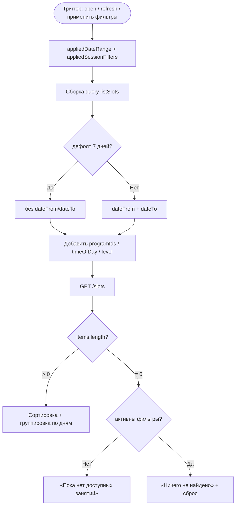

# LOGIC-005 — Фильтрация занятий

**ID:** LOGIC-005  
**Тип:** Логика  
**Приоритет:** Must  
**Статус:** Актуален

> **Продукт:** гончарная мастерская «Глина» · **Платформа:** Android · **Роль:** Клиент (R-028).
> **API:** [../api/openapi.yaml](../api/openapi.yaml) · **Модель данных:** [../4-design/data-model.md](../4-design/data-model.md).

---

## Обзор

Формирует query-параметры для `listSlots` из фильтров периода ([SCR-002](../../3-design-brief/screens/SCR-002-date-filter.md))
и занятий ([SCR-003](../../3-design-brief/screens/SCR-003-session-filters.md)), управляет badge на [SCR-001](../../3-design-brief/screens/SCR-001-schedule.md),
сортировкой и группировкой по дням, empty states.

Фильтры MVP: **время суток**, **уровень** (`BEGINNER` / `INTERMEDIATE` / `ADVANCED`), **программа** (`programIds` из `listPrograms`). Фильтр по мастеру **не реализуется** (FR-003).

**Не хардкодить:** лимиты групп (6 на новичковые — от мастера/программы), прокатный фонд, цены программ — только из API (R-015, FR-026).

---

## Точки применения

| Экран | Элемент / триггер |
| :-- | :-- |
| [SCR-001](../../3-design-brief/screens/SCR-001-schedule.md) | Загрузка списка, pull-to-refresh, empty, badge «Фильтры» |
| [SCR-002](../../3-design-brief/screens/SCR-002-date-filter.md) | «Применить» / «Сбросить» — `dateFrom`/`dateTo` |
| [SCR-003](../../3-design-brief/screens/SCR-003-session-filters.md) | «Применить» / «Сбросить» — `programIds`, `timeOfDay`, `level` |

> Ссылки на экраны — только в [3-design-brief/screens/](../../3-design-brief/screens/).

---

## Флоу

---

## Описание логики

### Параметры `listSlots`

| Параметр | Источник | По умолчанию | Правило |
| :-- | :-- | :-- | :-- |
| `dateFrom`, `dateTo` | SCR-002 | — | Не передаются при дефолте 7 дней (R-027, FR-001) |
| `programIds` | SCR-003 | все | OR внутри группы; не передаётся при `[]` |
| `timeOfDay` | SCR-003 | все | `morning` (06:00–11:59) / `afternoon` (12:00–16:59) / `evening` (17:00–23:59) |
| `level` | SCR-003 | все | `BEGINNER` / `INTERMEDIATE` / `ADVANCED` |

Справочник программ: `listPrograms` на SCR-003 (лепка, работа на круге). `id` элементов передаётся в `programIds`.

Период (`dateFrom`/`dateTo`) **не сбрасывается** при смене фильтров занятий на SCR-003 и наоборот.

### Badge «Фильтры»

Считается число **заполненных категорий** (0–3), не число выбранных программ:

| Категория | +1 если |
| :-- | :-- |
| Программа | `programIds.length > 0` |
| Время суток | `timeOfDay` задан |
| Уровень | `level` задан |

Период ≠ дефолт — отдельный чип «Период», **не** входит в badge «Фильтры».

### Empty states

| Условие | Текст |
| :-- | :-- |
| Пусто, дефолтный период и фильтры | «Пока нет доступных занятий» (FR-005) |
| Пусто, активны фильтры или кастомный период | «Ничего не найдено» + CTA «Сбросить фильтры» |

«Сбросить фильтры» сбрасывает **только** фильтры SCR-003 (программа, время, уровень), период SCR-002 сохраняется.

### Группировка (клиент)

1. Сортировка: `startsAt` ↑.
2. Группировка по календарному дню (`startsAt` в локальной TZ устройства).
3. Заголовки: «Сегодня», «Завтра», иначе «День недели, D MMM» (ru-RU).

### Кэш справочника

`listPrograms` рекомендуется кэшировать при первом открытии SCR-003 (TTL на усмотрение реализации). Ошибка `listPrograms` не блокирует фильтры времени и уровня.

**Терминология MVP:** **мастер**, **занятие / слот**, **программа** (лепка / круг), **мастерская**.

**Вне MVP (не описывать в логике):** лист ожидания (FR-011), фильтр по мастеру, онлайн-оплата, аллергии, текстовые отзывы, iOS.

---

## Входные / выходные данные

| Параметр | Тип | Направление | Описание |
| :-- | :-- | :--: | :-- |
| `appliedDateRange` | object | Вход | Период из SCR-002 (`dateFrom?`, `dateTo?`, флаг дефолта) |
| `appliedSessionFilters` | object | Вход | Фильтры из SCR-003 |
| `queryParams` | object | Выход | Для `listSlots` |
| `filterBadgeCount` | int | Выход | 0–3 (категории фильтров) |
| `hasActiveFilters` | boolean | Выход | Любой фильтр SCR-003 или не-дефолтный период |

**operationId:** `listSlots`, `listPrograms` — см. [openapi.yaml](../api/openapi.yaml).

---

## Связанные требования

| ID | Описание |
| :-- | :-- |
| FR-001–FR-005 | Расписание и фильтры |
| FR-003 | Время суток, уровень, программа |
| R-027 | Дефолт 7 дней |
| UC-001 | Просмотр расписания |
| US-002 | Изменение периода |
| US-003 | Фильтрация по времени, уровню и программе |
| US-005 | Понятное сообщение при отсутствии занятий |

---

## Критерии приёмки

| ID | Критерий |
| :-- | :-- |
| AC-L-001 | **Дано** «Сбросить» на SCR-002, **Тогда** `dateFrom`/`dateTo` не передаются, API возвращает слоты за 7 дней. |
| AC-L-002 | **Дано** выбраны программа «Лепка» и `timeOfDay=evening`, **Тогда** badge = 2, query содержит `programIds` и `timeOfDay`. |
| AC-L-003 | **Дано** выбран только `level=BEGINNER`, **Тогда** badge = 1, query содержит `level=BEGINNER`. |
| AC-L-004 | **Дано** активны все три категории фильтров, **Тогда** badge = 3. |
| AC-L-005 | **Дано** пустой список при активных фильтрах, **Тогда** empty «Ничего не найдено» + «Сбросить фильтры». |
| AC-L-006 | **Дано** пустой список при дефолтных фильтрах и периоде, **Тогда** empty «Пока нет доступных занятий». |
| AC-L-007 | **Дано** непустой список, **Тогда** карточки отсортированы по `startsAt` и сгруппированы по дням с заголовками «Сегодня»/«Завтра». |
| AC-L-008 | **Дано** изменён период на SCR-002 и фильтры на SCR-003, **Тогда** оба набора параметров переданы в один запрос `listSlots`. |
