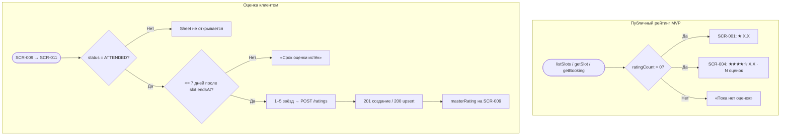

# LOGIC-006 — Оценка мастера

**ID:** LOGIC-006  
**Тип:** Логика  
**Приоритет:** Must  
**Статус:** Актуален

> **Продукт:** гончарная мастерская «Глина» · **Платформа:** Android · **Роль:** Клиент (R-028).
> **API:** [../api/openapi.yaml](../api/openapi.yaml) · **Модель данных:** [../4-design/data-model.md](../4-design/data-model.md).

---

## Обзор

**Отображение** публичного рейтинга мастера (`master.avgRating`, `master.ratingCount`) на карточках занятий и в деталях (FR-023) и **создание/обновление** оценки 1–5 через `createOrUpdateMasterRating` после посещённого занятия (FR-021–FR-022).

В **MVP** рейтинги отображаются на [SCR-001](../../3-design-brief/screens/SCR-001-schedule.md) и [SCR-004](../../3-design-brief/screens/SCR-004-session-detail.md). Оценка клиентом — [SCR-009](../../3-design-brief/screens/SCR-009-booking-detail.md) → [SCR-011](../../3-design-brief/screens/SCR-011-rate-master.md).

**Не хардкодить:** агрегаты рейтинга (`avgRating`, `ratingCount`) — только из API; порог 7 дней — бизнес-константа домена.

---

## Точки применения

| Экран | Элемент / триггер |
| :-- | :-- |
| [SCR-001](../../3-design-brief/screens/SCR-001-schedule.md) | Блок рейтинга на карточке занятия |
| [SCR-004](../../3-design-brief/screens/SCR-004-session-detail.md) | Карточка мастера — публичный рейтинг |
| [SCR-009](../../3-design-brief/screens/SCR-009-booking-detail.md) | CTA «Оценить мастера» / «Изменить оценку»; read-only `masterRating` |
| [SCR-011](../../3-design-brief/screens/SCR-011-rate-master.md) | Выбор звёзд, `createOrUpdateMasterRating` |

> Ссылки на экраны — только в [3-design-brief/screens/](../../3-design-brief/screens/).

---

## Флоу

---

## Описание логики

### Отображение (read-only, MVP)

| Контекст | Условие | UI |
| :-- | :-- | :-- |
| SCR-001 | `master.ratingCount > 0` и `avgRating != null` | **★ X.X** (1 знак после запятой) |
| SCR-001 | `ratingCount = 0` или `avgRating = null` | «Пока нет оценок» |
| SCR-004 | `ratingCount > 0` | Звёзды + «X,X · N оценок» (склонение ru-RU) |
| SCR-004 | иначе | «Пока нет оценок» |
| SCR-009 (блок мастера) | `ratingCount > 0` | **★ X.X** рядом с именем |

Рейтинг **не скрывается** в MVP — это отличие от «Апекс» (task3), где отображение было v2.

### Создание / обновление

**API:** POST `/ratings` → `createOrUpdateMasterRating`

| Поле | Описание |
| :-- | :-- |
| `masterId` | Обязателен |
| `bookingId` | Для проверки `ATTENDED` при первой оценке через SCR-011 |
| `stars` | 1–5, без текстового отзыва |

| Правило | Описание |
| :-- | :-- |
| Условие | `Booking.status = ATTENDED` |
| Срок | **7 дней** после окончания занятия (`slot.endsAt`) |
| Уникальность | **Один клиент — одна оценка на мастера**; повторный POST обновляет (FR-022) |
| Ответ | 201 создание / 200 обновление |

Ошибки: 403 `BOOKING_NOT_ATTENDED`, `RATING_PERIOD_EXPIRED`.

### SCR-009 — CTA и `masterRating`

| `masterRating` | `status` | Срок | UI |
| :-- | :-- | :-- | :-- |
| `null` | `ATTENDED` | ≤ 7 дней | CTA «Оценить мастера» → SCR-011 |
| объект | `ATTENDED` | ≤ 7 дней | Read-only звёзды + CTA «Изменить оценку» |
| любой | `ATTENDED` | > 7 дней | CTA скрыт; при попытке открыть SCR-011 — «Оценить можно в течение недели после занятия» |
| любой | ≠ `ATTENDED` | — | CTA скрыт |

Поле `booking.masterRating` из `getBooking`: `null` — можно оценить; объект — read-only оценка клиента для данного мастера.

**Терминология MVP:** **мастер** (не «инструктор»), **занятие / слот**, **программа** (лепка / круг).

**Вне MVP (не описывать в логике):** текстовые отзывы, теги, фильтр по мастеру, iOS.

---

## Входные / выходные данные

| Параметр | Тип | Направление | Описание |
| :-- | :-- | :--: | :-- |
| `masterId` | uuid | Вход | Мастер занятия |
| `bookingId` | uuid | Вход | Бронь для проверки посещения |
| `stars` | int 1–5 | Вход/Выход | Оценка |
| `master.avgRating` | float? | Вход | Публичный средний рейтинг |
| `master.ratingCount` | int | Вход | Число оценок |
| `booking.masterRating` | object? | Вход | Оценка текущего клиента |
| `canRate` | boolean | Выход | `ATTENDED` + в сроке + онлайн |
| `displayRating` | string | Выход | «★ X.X» или «Пока нет оценок» |

**operationId:** `createOrUpdateMasterRating` — см. [ratings.yaml](../api/paths/ratings.yaml).

---

## Связанные требования

| ID | Описание |
| :-- | :-- |
| FR-021 | Оценка мастера в течение 7 дней после посещения |
| FR-022 | Одна оценка на мастера; upsert при повторной отправке |
| FR-023 | Публичный рейтинг на SCR-001 и SCR-004 |
| UC-007 | Оценка мастера после занятия |
| US-015 | Оценка мастера звёздами |
| US-016 | Рейтинги при выборе занятия |
| NFR-008 | Тексты на русском |

---

## Критерии приёмки

| ID | Критерий |
| :-- | :-- |
| AC-L-001 | **Дано** `master.ratingCount > 0`, **Когда** карточка на SCR-001, **Тогда** рейтинг в формате `★ X.X`. |
| AC-L-002 | **Дано** `master.ratingCount = 0`, **Когда** SCR-001 или SCR-004, **Тогда** текст «Пока нет оценок». |
| AC-L-003 | **Дано** `status = ATTENDED`, в сроке 7 дней, `masterRating = null`, **Когда** SCR-009, **Тогда** CTA «Оценить мастера» активен. |
| AC-L-004 | **Дано** `status = ATTENDED`, в сроке, **Когда** SCR-011 отправляет 4 звезды, **Тогда** `createOrUpdateMasterRating` → 201, на SCR-009 отображается оценка. |
| AC-L-005 | **Дано** повторная оценка того же мастера, **Тогда** POST `/ratings` → 200 upsert, дубликат не создаётся (FR-022). |
| AC-L-006 | **Дано** > 7 дней после `slot.endsAt`, **Когда** попытка оценить, **Тогда** 403 `RATING_PERIOD_EXPIRED` или сообщение «Срок оценки истёк». |
| AC-L-007 | **Дано** `status ≠ ATTENDED`, **Когда** клиент пытается открыть SCR-011, **Тогда** 403 `BOOKING_NOT_ATTENDED` или сообщение «Оценить можно после посещения занятия». |
| AC-L-008 | **Дано** `masterRating` уже задан, **Когда** SCR-009 в Content, **Тогда** read-only звёзды и CTA «Изменить оценку». |
