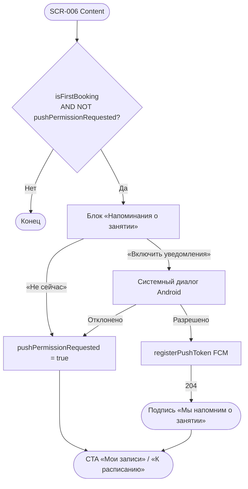

# LOGIC-007 — Запрос push-разрешения

**ID:** LOGIC-007  
**Тип:** Логика  
**Приоритет:** Must  
**Статус:** Актуален

> **Продукт:** гончарная мастерская «Глина» · **Платформа:** Android · **Роль:** Клиент (R-028).
> **API:** [../../api/openapi.yaml](../../api/openapi.yaml) · **Модель данных:** [../../4-design/data-model.md](../../4-design/data-model.md).

---

## Обзор

Запрос разрешения на push-уведомления после **первой успешной брони** на устройстве (FR-024, NFR-010). Показ — **один раз**; отказ не блокирует приложение и навигацию с SCR-006. После разрешения FCM-токен регистрируется через `registerPushToken` с `platform: android`.

Push входит в **MVP**; SMS и email — вне скоупа (NFR-010).

**Не хардкодить:** типы и тексты уведомлений задаёт бэкенд; клиент обрабатывает deep links на SCR-009 и SCR-001.

---

## Точки применения

| Экран | Элемент / триггер |
| :-- | :-- |
| [SCR-006](../../3-design-brief/screens/SCR-006-booking-success.md) | Блок «Напоминания о занятии» после отрисовки сводки успешной записи |

> Ссылки на экраны — только в [3-design-brief/screens/](../../3-design-brief/screens/).

---

## Флоу



---

## Описание логики

### Условия показа primer-блока

| Условие | Значение |
| :-- | :-- |
| `isFirstBooking` | Первая успешная бронь на устройстве |
| `pushPermissionRequested` | `false` — primer ещё не показывался или пользователь не выбирал «Не сейчас» |
| OS permission | Не `granted` — иначе primer скрыт, сразу подпись «Мы напомним о занятии» |
| Момент | После Content на SCR-006; **не блокирует** CTA «Мои записи» / «К расписанию» |

При повторных записях (`isFirstBooking = false`) блок push **скрыт**.

### Поведение CTA

| Действие | Результат |
| :-- | :-- |
| «Включить уведомления» | Системный диалог Android → при разрешении async `registerPushToken` |
| «Не сейчас» | Блок скрывается; `pushPermissionRequested = true`; без nag-screen при следующих SCR-006 |
| Отказ в OS-диалоге | Блок скрывается; `pushPermissionRequested = true`; повторный запрос на SCR-006 **не** показывается |

### registerPushToken

**POST** `/profile/push-token` · `Authorization: Bearer {sessionToken}`

```json
{ "token": "<FCM>", "platform": "android" }
```

| HTTP | Поведение |
| :-- | :-- |
| 204 | Успех; UI не прерывается |
| 401 / 400 / 500 | Ошибка логируется; навигация с SCR-006 работает штатно |

`sessionToken` берётся из ответа `createBooking` (201) или сохранённого ClientSession.

### Типы push-уведомлений (FR-024, FR-017, FR-020)

| Событие | Deep link |
| :-- | :-- |
| Напоминание за день | SCR-009 (`app://bookings/{bookingId}`) |
| Напоминание за 2 ч | SCR-009 |
| Подтверждение записи | SCR-009 |
| Отмена клиентом | SCR-009 |
| Отмена мастерской | SCR-009 → CTA «Перезаписаться» → SCR-001 |
| Перенос занятия | SCR-009 (блок `rescheduleInfo`) |
| Оценка мастера (после посещения) | SCR-009 → SCR-011 |

> Лист ожидания **не** используется. SMS — вне MVP (NFR-010).

**Терминология MVP:** **мастер** (не «инструктор»), **занятие / слот**, **программа** (лепка / круг).

**Вне MVP (не описывать в логике):** лист ожидания (FR-011), фильтр по мастеру, онлайн-оплата, аллергии, текстовые отзывы, iOS, штрафы за позднюю отмену, SMS.

---

## Входные / выходные данные

| Параметр | Тип | Направление | Описание |
| :-- | :-- | :--: | :-- |
| `isFirstBooking` | boolean | Вход | Первая бронь на устройстве |
| `pushPermissionRequested` | boolean | Вход / Выход | Флаг локального хранилища |
| `sessionToken` | string | Вход | ClientSession после `createBooking` |
| `deviceToken` | string | Выход | FCM-токен устройства |

**operationId:** `registerPushToken` — см. OpenAPI.

---

## Связанные требования

| ID | Описание |
| :-- | :-- |
| FR-017 | Push при отмене мастерской с перезаписью |
| FR-018 | Перезапись через SCR-001 после push |
| FR-020 | Push и отображение переноса на SCR-009 |
| FR-024 | Push: напоминания, подтверждение, отмена, перенос |
| NFR-010 | Только push; deep links на SCR-009 / SCR-001 |
| UC-008 | Получение push-напоминаний |
| US-017 | Push-напоминания о занятии |

---

## Критерии приёмки

| ID | Критерий |
| :-- | :-- |
| AC-L-001 | **Дано** первая бронь, `pushPermissionRequested = false`, push не разрешён в OS, **Когда** SCR-006 в Content, **Тогда** показан блок «Напоминания о занятии» с CTA «Включить уведомления» и «Не сейчас». |
| AC-L-002 | **Дано** клиент нажал «Не сейчас» или отклонил OS-диалог, **Тогда** навигация с SCR-006 («Мои записи», «К расписанию») работает штатно; повторный primer на SCR-006 не показывается. |
| AC-L-003 | **Дано** разрешение push в OS, **Когда** получен FCM-токен, **Тогда** async `registerPushToken` с `{ "token": "<FCM>", "platform": "android" }`; ошибки API не блокируют UI. |
| AC-L-004 | **Дано** вторая и последующие записи, **Тогда** блок push-разрешения на SCR-006 **скрыт**. |
| AC-L-005 | **Дано** push уже разрешён в OS, **Когда** SCR-006 открыт после первой записи, **Тогда** primer скрыт, показана подпись «Мы напомним о занятии». |
