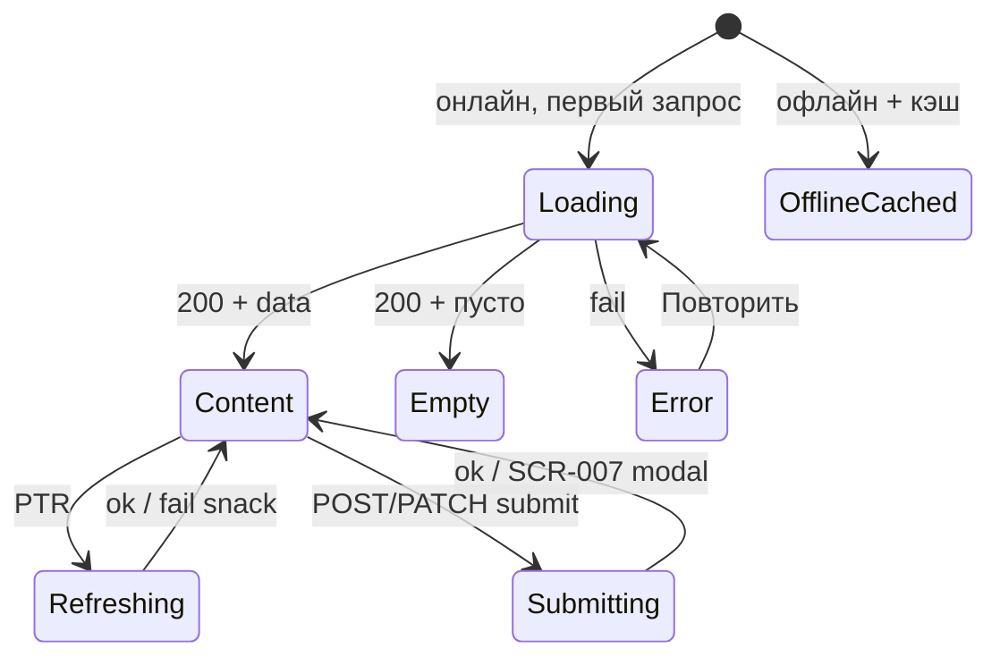

# LOGIC-008 — Паттерн состояний экрана

**ID:** LOGIC-008  
**Тип:** Логика  
**Приоритет:** Must  
**Статус:** Актуален

> **Продукт:** гончарная мастерская «Глина» · **Платформа:** Android · **Роль:** Клиент (R-028).
> **API:** [../../api/openapi.yaml](../../api/openapi.yaml) · **Модель данных:** [../../4-design/data-model.md](../../4-design/data-model.md).

---

## Обзор

Единый UI-паттерн для экранов с GET через Client API: **Loading**, **Content**, **Empty**, **Error**, **Offline**, **Refreshing**, **Submitting**. Согласованность SCR-001, SCR-004, SCR-005, SCR-008, SCR-009, SCR-012.

**Не входит:** SCR-002, SCR-003 (sheet без полноэкранного reload), SCR-006, SCR-007; sheet/dialog с одним submit (SCR-010, SCR-011).

**Не хардкодить:** лимиты групп, прокатный фонд, цены программ — только из API (R-015, FR-026).

---

## Точки применения

| Экран | Триггер | Состояния |
| :-- | :-- | :-- |
| [SCR-001](../../3-design-brief/screens/SCR-001-schedule.md) | Вкладка, PTR, retry | Loading, Content, Empty, Error, Refreshing |
| [SCR-003](../../3-design-brief/screens/SCR-003-session-filters.md) | `listPrograms` | Loading, Content, Error (inline в sheet) |
| [SCR-004](../../3-design-brief/screens/SCR-004-session-detail.md) | `getSlot` | Loading, Content, Error, Refreshing |
| [SCR-005](../../3-design-brief/screens/SCR-005-booking-form.md) | `getProfile`, `getSlot` | Loading, Content, Error + Submitting |
| [SCR-008](../../3-design-brief/screens/SCR-008-my-bookings.md) | Вкладка, PTR | Loading, Content, Empty, Error, Offline, Refreshing |
| [SCR-009](../../3-design-brief/screens/SCR-009-booking-detail.md) | `getBooking`, deep link | Loading, Content, Error, Offline |
| [SCR-012](../../3-design-brief/screens/SCR-012-contact-profile.md) | `getProfile` в sheet | Loading, Content, Error |

> Ссылки на экраны — только в [3-design-brief/screens/](../../3-design-brief/screens/).

---

## Флоу

---

## Описание логики

### Канонические состояния

| Состояние | UI | Поведение |
| :-- | :-- | :-- |
| **Loading** | Skeleton / shimmer | Блокирует контент |
| **Content** | Макет экрана | Интерактивен |
| **Empty** | Иллюстрация + текст + CTA | См. таблицу ниже |
| **Error** | Иконка + «Повторить» | Retry → Loading |
| **Offline cached** | Кэш + баннер «Офлайн» | SCR-008, SCR-009 |
| **Refreshing** | Индикатор поверх Content | Не сбрасывать в Loading |
| **Submitting** | Spinner на CTA | POST/PATCH на SCR-005, SCR-010, SCR-011, SCR-012 |

### Empty по экранам

| Экран | Текст | CTA |
| :-- | :-- | :-- |
| SCR-001 | «Пока нет доступных занятий» (FR-005) | — |
| SCR-001 + фильтры | «Ничего не найдено» | «Сбросить фильтры» |
| SCR-008 | «У вас пока нет записей» | «Посмотреть расписание» → SCR-001 |

### Error

| Тип | Текст |
| :-- | :-- |
| Нет сети | «Нет подключения к интернету» |
| 5xx / timeout | «Не удалось загрузить данные» |
| 404 detail | «Занятие не найдено» / «Запись не найдена» |

### Офлайн (NFR-009)

- **SCR-008, SCR-009:** кэш последнего `listBookings` / `getBooking`; баннер «Офлайн»; destructive-действия (отмена) disabled.
- **SCR-001, SCR-004, SCR-005:** без кэша в MVP → Error.

### Частные правила

| Экран | Примечание |
| :-- | :-- |
| SCR-002 | Без собственного list reload; только передача параметров в SCR-001 |
| SCR-003 | Loading/error inline при `listPrograms`; без Empty (справочник программ всегда непуст) |
| SCR-005 | Submitting на «Записаться»; не full-screen Loading при submit |
| SCR-006 | Только Content после 201; вне паттерна |
| SCR-007 | Dialog от SCR-005; вне паттерна |
| SCR-010, SCR-011 | Submitting на confirm / «Отправить» |

### Android-специфика

- Pull-to-refresh — **Material `SwipeRefreshLayout`** (или Compose аналог) на SCR-001, SCR-008.
- Sticky CTA на SCR-004, SCR-005 — через `CoordinatorLayout` / insets; **без** iOS safe area.
- Snackbar при ошибке PTR — Material; список не очищается.

**Терминология MVP:** **мастер**, **занятие / слот**, **программа** (лепка / круг).

**Вне MVP (не описывать в логике):** лист ожидания (FR-011), фильтр по мастеру, онлайн-оплата, аллергии, текстовые отзывы, iOS, штрафы за позднюю отмену.

---

## Входные / выходные данные

| Параметр | Тип | Направление | Описание |
| :-- | :-- | :--: | :-- |
| `screenState` | enum | Выход | Текущее состояние UI |
| `cachedData` | object? | Вход / Выход | Офлайн-кэш для SCR-008, SCR-009 |
| `isRefreshing` | boolean | Выход | Флаг PTR без сброса Content |

**operationId (по экранам):** `listSlots`, `listPrograms`, `getSlot`, `getProfile`, `listBookings`, `getBooking` — см. OpenAPI.

---

## Связанные требования

| ID | Описание |
| :-- | :-- |
| FR-001, FR-005 | Empty расписания |
| FR-013 | Список броней |
| NFR-001 | Android-клиент |
| NFR-008 | Тексты на русском |
| NFR-009 | Офлайн-кэш «Мои записи» |
| NFR-010 | Deep link на SCR-009 при загрузке `getBooking` |

---

## Критерии приёмки

| ID | Критерий |
| :-- | :-- |
| AC-L-001 | **Дано** SCR-001 первый load, **Тогда** skeleton до ответа `listSlots`. |
| AC-L-002 | **Дано** пустой `items`, дефолтные фильтры, **Тогда** «Пока нет доступных занятий». |
| AC-L-003 | **Дано** PTR на Content SCR-001 или SCR-008, **Когда** запрос fail, **Тогда** snack «Не удалось обновить», список не очищается. |
| AC-L-004 | **Дано** SCR-008 офлайн с кэшем, **Тогда** список броней + баннер «Офлайн»; отмена недоступна. |
| AC-L-005 | **Дано** SCR-005 submit, **Тогда** Submitting на CTA «Записаться», не full-screen Loading. |
| AC-L-006 | **Дано** SCR-003 открыт, **Когда** `listPrograms` в процессе, **Тогда** inline loading в sheet; при ошибке — inline «Повторить». |
| AC-L-007 | **Дано** deep link на SCR-009, **Когда** `getBooking` в процессе, **Тогда** skeleton до Content или Error. |
