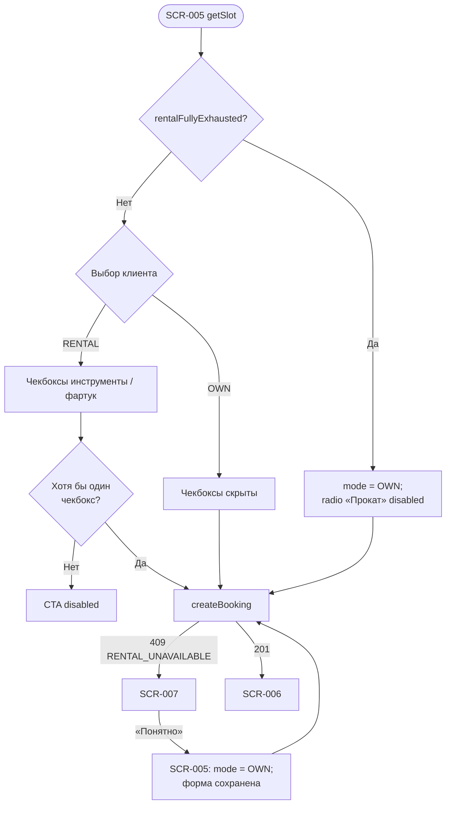

# LOGIC-009 — Выбор экипировки

**ID:** LOGIC-009  
**Тип:** Логика  
**Приоритет:** Must  
**Статус:** Актуален

> **Продукт:** гончарная мастерская «Глина» · **Платформа:** Android · **Роль:** Клиент (R-028).
> **API:** [../../api/openapi.yaml](../../api/openapi.yaml) · **Модель данных:** [../../4-design/data-model.md](../../4-design/data-model.md).

---

## Обзор

Выбор режима экипировки при оформлении записи: **OWN** (со своим) или **RENTAL** (прокат). При `RENTAL` клиент отмечает `rentalTools` и/или `rentalApron`. Прокат **не влияет на цену** — сумма определяется только программой (FR-012).

При `rentalFullyExhausted = true` на слоте доступен только **OWN**; radio «Нужен прокат» **disabled** (FR-008). При гонке за прокат бэкенд возвращает `409 RENTAL_UNAVAILABLE` → SCR-007 → переключение на OWN на SCR-005.

**Не хардкодить:** остатки проката (`toolsAvailable`, `apronsAvailable`, `rentalFullyExhausted`) — только из `getSlot.rentalAvailability` (R-015).

---

## Точки применения

| Экран | Элемент / триггер |
| :-- | :-- |
| [SCR-005](../../3-design-brief/screens/SCR-005-booking-form.md) | Секция экипировки: radio OWN/RENTAL, чекбоксы проката, валидация CTA |
| [SCR-007](../../3-design-brief/screens/SCR-007-booking-error.md) | Код `RENTAL_UNAVAILABLE` → рекомендация «Со своим» → возврат на SCR-005 |

> Ссылки на экраны — только в [3-design-brief/screens/](../../3-design-brief/screens/).

---

## Флоу

---

## Описание логики

### Режимы экипировки (`EquipmentMode`)

| Режим | UI | Тело `createBooking.equipment` |
| :-- | :-- | :-- |
| **OWN** | Radio «Со своим»; чекбоксы скрыты | `{ "mode": "OWN" }` |
| **RENTAL** | Radio «Нужен прокат» + чекбоксы | `{ "mode": "RENTAL", "rentalTools": bool, "rentalApron": bool }` |

### Правила выбора

| Условие | Поведение |
| :-- | :-- |
| `rentalFullyExhausted = true` | Только OWN; radio «Нужен прокат» **disabled**; пояснение «Прокат закончился — можно записаться со своим снаряжением» |
| `mode = RENTAL`, ни один чекбокс | CTA «Записаться» **disabled**; inline «Выберите, что нужно взять в прокат» |
| `mode = RENTAL`, хотя бы tools **или** apron | CTA активен (при валидных контактах) |
| `toolsAvailable = 0` | Чекбокс «Инструменты» disabled + «Нет в прокате» |
| `apronsAvailable = 0` | Чекбокс «Фартук» disabled + «Нет в прокате» |
| Частичный прокат | Доступные чекбоксы активны; недоступные — disabled |

### Цена (FR-012)

- Блок «Итого» / «К оплате на месте» = **цена программы** (`slot.price` / `booking.totalPrice`).
- Прокат **не добавляет** строк в разбивку; подпись «Прокат бесплатный» — информационная.
- Логика цены делегируется [LOGIC-003](LOGIC-003_Расчёт-цены-брони.md); L-009 не меняет сумму.

### Обработка `RENTAL_UNAVAILABLE` (FR-008)

1. `createBooking` → 409, `code: RENTAL_UNAVAILABLE`.
2. SCR-007 modal: «Прокат закончился… Запишитесь **со своим** снаряжением».
3. «Понятно» → modal закрывается; SCR-005 **сохраняет** контакты и прочие поля.
4. Автоматически или вручную: `equipment.mode = OWN`; radio «Со своим» выбран.
5. Повторный submit → 201 → SCR-006.

> Слот **не блокируется** при исчерпании проката — блокируется только выбор RENTAL.

**Терминология MVP:** **мастер**, **занятие / слот**, **программа**; экипировка — инструменты, фартук.

**Вне MVP (не описывать в логике):** лист ожидания (FR-011), фильтр по мастеру, онлайн-оплата, аллергии, текстовые отзывы, iOS, штрафы за позднюю отмену.

---

## Входные / выходные данные

| Параметр | Тип | Направление | Описание |
| :-- | :-- | :--: | :-- |
| `rentalAvailability` | RentalAvailability | Вход | Из `getSlot`; остатки и `rentalFullyExhausted` |
| `equipment.mode` | OWN \| RENTAL | Вход / Выход | Выбранный режим |
| `equipment.rentalTools` | boolean | Вход / Выход | Прокат инструментов |
| `equipment.rentalApron` | boolean | Вход / Выход | Прокат фартука |
| `isEquipmentValid` | boolean | Выход | CTA может быть активен |
| `equipment` | EquipmentChoice | Выход | Тело `createBooking` |

**operationId:** `getSlot` (вход), `createBooking` (выход) — см. OpenAPI.

---

## Связанные требования

| ID | Описание |
| :-- | :-- |
| FR-007 | Выбор своего или прокатного снаряжения |
| FR-008 | При исчерпании проката — только «со своим» |
| FR-012 | Прокат не влияет на цену |
| FR-009 | Передача `equipment` в `createBooking` |
| UC-002 | Оформление записи с экипировкой |
| US-006 | Контакты и экипировка при записи |
| US-019 | Запись «со своим» при исчерпании проката |

---

## Критерии приёмки

| ID | Критерий |
| :-- | :-- |
| AC-L-001 | **Дано** `rentalFullyExhausted = true`, **Когда** SCR-005 загружен, **Тогда** выбран OWN, radio «Нужен прокат» disabled, показано пояснение (FR-008). |
| AC-L-002 | **Дано** `mode = RENTAL`, ни `rentalTools`, ни `rentalApron` не выбраны, **Тогда** CTA «Записаться» disabled с подсказкой о выборе проката. |
| AC-L-003 | **Дано** `mode = RENTAL`, выбран хотя бы один доступный чекбокс, **Когда** контакты валидны, **Тогда** CTA активен; «Итого» равно цене программы без строк проката (FR-012). |
| AC-L-004 | **Дано** `mode = OWN`, **Когда** submit, **Тогда** `createBooking.equipment = { "mode": "OWN" }`. |
| AC-L-005 | **Дано** `createBooking` вернул `RENTAL_UNAVAILABLE`, **Когда** пользователь нажал «Понятно» в SCR-007, **Тогда** форма SCR-005 сохранена, `mode` переключён на OWN, повторный submit возможен. |
| AC-L-006 | **Дано** `toolsAvailable = 0`, `apronsAvailable > 0`, **Когда** выбран RENTAL, **Тогда** чекбокс «Инструменты» disabled; запись возможна только с фартуком. |
