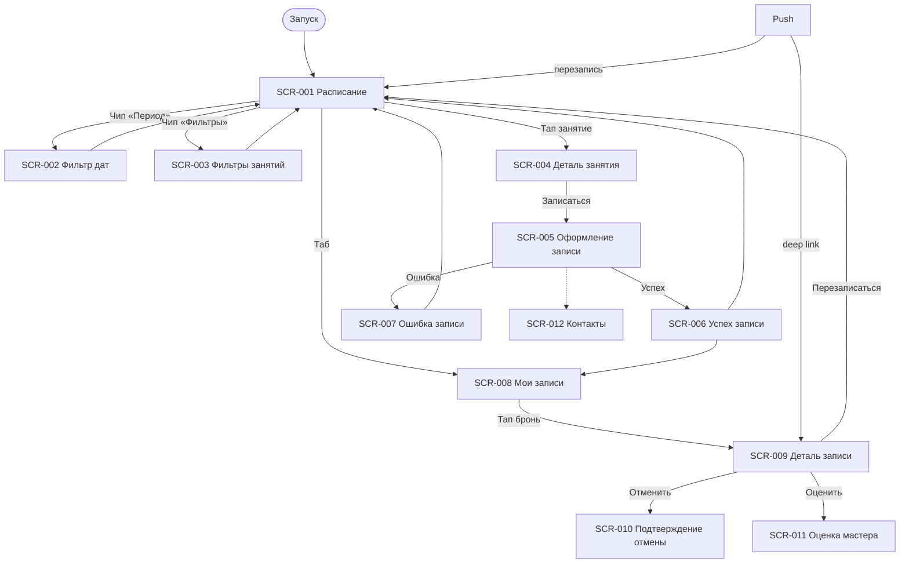

# Фича-лист — мобильное приложение «Глина»

> **Этап 5.** Перечень экранов клиентского приложения и функций на них.
> Связующий артефакт между [требованиями](../2-requirements/) и детальным ТЗ.

**Статус:** Актуален · **Версия:** 1.0 · **Дата:** 2026-07-03

---

## 1. Назначение

**«Глина»** — клиентское Android-приложение для самостоятельной записи на мастер-классы гончарной мастерской.
Заменяет ручную запись через Instagram-директ и ежедневник, устраняя двойные брони мест и кругов.

**Скоуп — только роль «Клиент»** (R-028). Владелец и мастера работают через существующую инфраструктуру.
Справочные данные (слоты, программы, мастера, прокат) — **read-only** из API. Оплата —
**на месте**; приложение показывает цену и фиксирует запись.

**Источники:**
[brief-pottery.md](../0-customer-brief/brief-pottery.md) ·
[2-requirements/](../2-requirements/) ·
[3-design-brief/](../3-design-brief/) ·
[4-design/](../4-design/) ·
[customer-questions.md](../1-elicitation/customer-questions.md)

---

## 2. Глоссарий

| Термин | Значение |
|--------|----------|
| **Слот / занятие** | Мастер-класс: дата, время (2–2,5 ч), программа, мастер, доступность, цена |
| **Программа** | Лепка для новичков / работа на гончарном круге; определяет **цену** (FR-012) |
| **Мастер** | Ведёт занятие; лимит группы (в т.ч. **6** на новичковые) настраивается на уровне мастера |
| **Бронь** | Запись клиента: статус, выбор экипировки |
| **Экипировка** | Инструменты, фартук — своё или прокат; **не влияет на цену** (FR-012) |
| **Ранняя отмена** | ≥ 3 ч до начала → место освобождается сразу (FR-014) |
| **Поздняя отмена** | < 3 ч до начала → предупреждение о заготовленной глине; отмена разрешена, штрафов нет (FR-015) |
| **Постоянный клиент** | Метка в профиле; приоритет при записи (FR-025) |

> **Принцип:** лимиты групп, прокатный фонд и цены **не хардкодятся** — приходят из API (R-015).
> Доступность — только **«есть места» / «мест нет»** (`hasSpots`), без счётчика и номера круга.

---

## 3. Карта навигации

---

## 4. Инвентарь экранов

| ID | Экран | Тип | Приоритет | Постановка |
|----|-------|-----|-----------|------------|
| SCR-001 | Расписание занятий | Экран (вкладка) | Must | [SCR-001-schedule.md](../3-design-brief/screens/SCR-001-schedule.md) |
| SCR-002 | Фильтр периода дат | Bottom Sheet | Must | [SCR-002-date-filter.md](../3-design-brief/screens/SCR-002-date-filter.md) |
| SCR-003 | Фильтры занятий | Bottom Sheet | Must | [SCR-003-session-filters.md](../3-design-brief/screens/SCR-003-session-filters.md) |
| SCR-004 | Деталь занятия | Экран | Must | [SCR-004-session-detail.md](../3-design-brief/screens/SCR-004-session-detail.md) |
| SCR-005 | Оформление записи | Экран | Must | [SCR-005-booking-form.md](../3-design-brief/screens/SCR-005-booking-form.md) |
| SCR-006 | Успешная запись | Экран | Must | [SCR-006-booking-success.md](../3-design-brief/screens/SCR-006-booking-success.md) |
| SCR-007 | Ошибка записи | Dialog | Must | [SCR-007-booking-error.md](../3-design-brief/screens/SCR-007-booking-error.md) |
| SCR-008 | Мои записи | Экран (вкладка) | Must | [SCR-008-my-bookings.md](../3-design-brief/screens/SCR-008-my-bookings.md) |
| SCR-009 | Деталь записи | Экран | Must | [SCR-009-booking-detail.md](../3-design-brief/screens/SCR-009-booking-detail.md) |
| SCR-010 | Подтверждение отмены | Bottom Sheet | Must | [SCR-010-cancel-confirm.md](../3-design-brief/screens/SCR-010-cancel-confirm.md) |
| SCR-011 | Оценка мастера | Bottom Sheet | Must | [SCR-011-rate-master.md](../3-design-brief/screens/SCR-011-rate-master.md) |
| SCR-012 | Контактные данные | Секция / Sheet | Must | [SCR-012-contact-profile.md](../3-design-brief/screens/SCR-012-contact-profile.md) |

---

## 5. Сквозные функции

- **Push-уведомления** (FR-017, FR-020, FR-024, NFR-010): напоминания, отмена мастерской, перенос, подтверждение записи
- **Офлайн-кэш** «Мои записи» (NFR-009): SCR-008, SCR-009
- **Паттерн состояний** [LOGIC-008](09_Логики/LOGIC-008_Паттерн-состояний-экрана.md): Loading → Content → Empty → Error → Offline → Refreshing
- **Один участник на бронь** (FR-010): без stepper количества участников
- **Рейтинги мастеров в расписании** (FR-023): SCR-001, SCR-004
- **Только русский язык** (NFR-008)

---

## 6. Не входит в MVP

| Функция | Источник |
|---------|----------|
| Лист ожидания | FR-011, backlog |
| Аллергии / мед. анкеты | domain §6 |
| Фильтр по мастеру | design-brief, backlog |
| Онлайн-оплата | domain §6 |
| iOS | NFR-001, backlog |
| Текстовые отзывы | domain §6 |
| Штрафы за позднюю отмену | FR-015, Q 3.3 |
| Админка / интерфейс мастера | R-028 |
| SMS / email / Instagram-уведомления | NFR-010 |

---

## 7. Трассировка требований → экраны

| Требование | Экран |
|------------|-------|
| FR-001–005 | SCR-001 |
| FR-002 | SCR-002 |
| FR-003 | SCR-003 |
| FR-004, FR-011, FR-012, FR-023 | SCR-004 |
| FR-006–FR-012, FR-019, FR-025 | SCR-005 → SCR-006 / SCR-007 |
| FR-013 | SCR-008, SCR-009 |
| FR-014, FR-015 | SCR-009, SCR-010 |
| FR-016–FR-019 | SCR-009 (статус «Отменено мастерской») |
| FR-017, FR-018 | SCR-009 (push, перезапись) |
| FR-020 | SCR-009 (перенос) |
| FR-021–FR-023 | SCR-001, SCR-004, SCR-009, SCR-011 |
| FR-024 | SCR-006, SCR-009 |
| FR-025 | SCR-005, SCR-012 |
| Q 1.1 | SCR-005, SCR-012 |
| UC-001 | SCR-001 → SCR-004 |
| UC-002 | SCR-004 → SCR-005 → SCR-006 / SCR-007 |
| UC-003 | SCR-008 → SCR-009 |
| UC-004 | SCR-009 → SCR-010 |
| UC-005 | SCR-009 |
| UC-006 | SCR-009 |
| UC-007 | SCR-011 |
| UC-008 | SCR-006, SCR-009 |

---

## 8. API контракт

Спецификация Client API: [openapi.yaml](../api/openapi.yaml) (версия 1.0.0).

Базовый URL: `https://api.glina-pottery.example/v1`. Идентификация — сессионный `Bearer`-токен
(`ClientSession`), выдаётся в ответах `PATCH /profile` и `POST /bookings`.

### Эндпоинты

| operationId | Метод | Путь | Tag | Экран(ы) | Назначение |
|-------------|-------|------|-----|----------|------------|
| `listSlots` | GET | `/slots` | slots | SCR-001 | Список занятий с фильтрами |
| `getSlot` | GET | `/slots/{slotId}` | slots | SCR-004, SCR-005 | Детали занятия, pre-check; поле `rentalAvailability` |
| `listPrograms` | GET | `/programs` | programs | SCR-003 | Справочник программ для фильтра |
| `listBookings` | GET | `/bookings` | bookings | SCR-008 | Список броней клиента |
| `createBooking` | POST | `/bookings` | bookings | SCR-005 | Создание брони (+ upsert профиля) |
| `getBooking` | GET | `/bookings/{bookingId}` | bookings | SCR-009, SCR-011 | Детали брони, deep link |
| `cancelBooking` | POST | `/bookings/{bookingId}/cancel` | bookings | SCR-010 | Отмена брони клиентом |
| `getProfile` | GET | `/profile` | profile | SCR-005, SCR-012 | Контактный профиль |
| `updateProfile` | PATCH | `/profile` | profile | SCR-012, SCR-005 | Upsert контактов |
| `registerPushToken` | POST | `/profile/push-token` | profile | SCR-006 | Регистрация FCM-токена |
| `createOrUpdateMasterRating` | POST | `/ratings` | ratings | SCR-011 | Оценка мастера |
